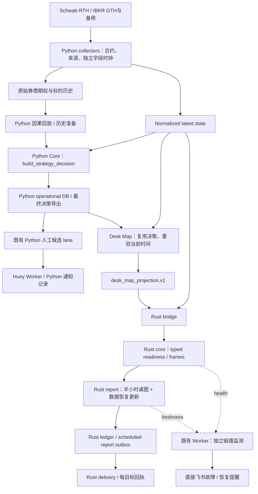

# SPX Spark

<!-- documentation-status: 2026-10-05 -->
> **文档定位：现行运行与参考。** 现行说明；历史段落保留原适用日期。运行状态以实际服务和源字段时钟为准。
> [全仓文档、当前运行状态与合同优先级](docs/README.md)（目录核对：2026-10-05）。

面向人工决策的 SPX/SPXW 行情、策略研究与 Desk Map 系统。常规 RTH 使用
Schwab，GTH 与 Schwab 故障备用使用 IBKR Paper。所有策略均为人工候选，
`automatic_ordering=false`；没有真实或 Paper 自动下单能力。

[全部文档与状态](docs/README.md) · [协作约束](AGENTS.md) ·
[部署手册](docs/headless-deployment.md) · [运行调度](docs/operations-schedule.md) ·
[数据能力](docs/market-data-capability-matrix.md)

## Current runtime overview

核对日期：2026-10-05。Python Core/Worker 与现有 Rust 运行时共同运行；
Phase 6 Rust 退出和 Phase 7 数据平台全面重写已延期。下面是已存在的组件。



Python 的 `build_strategy_decision` 是唯一人工候选授权出口。报告使用已提交
决策；完整 `strategy_decision` 不进入 Rust wire。Rust 拥有定时桌图及其投递，
不连接券商、不为 Python 策略选腿。具体边界见[单仓库合同](docs/monorepo-layout.md)
与[通知合同](docs/notification-architecture.md)。

旧 Live Surface/Replay 网站已退役，现有网站入口只提供固定通知图片。
[图片入口](site/spxw-surface/README.md)和[历史策略复盘页](site/strategy-review/README.md)
不能当作实时完整行情或账户持仓界面。

## 策略与数据状态

当前全局策略合同为 `strategy_policy.bootstrap.v69`，后续局部修复见
[文档目录中的策略合同](docs/README.md#strategy-contracts)。生产以 0DTE 为主：

| 结构 | 当前合同要点 | 说明 |
| --- | --- | --- |
| 方向 Debit Spread | 已授权价格/量价 setup、exact BBO 与几何门；通用管理无固定 20 分钟退出，保留对应止损/跟踪及硬退出 | 训练或研究的 20 分钟标签不等于现行完整持有政策 |
| RTH 铁鹰 | 09:30≤ET<15:45，按当前 Schwab 20Δ/10 点翼选腿；已取消每日一次和 10:00–11:00 限制 | 仍须环境、贷记、数据与风险门 |
| GTH 铁鹰 | IBKR 20Δ/10 点翼；扩张回落或已授权平缓收敛；报价/Greeks≤30 秒，BBO skew≤10 秒 | 保留会话约束与 0.5C/3C/对应交易日 12:30 ET 管理 |
| 蝶式 | Stable Pin 合同与 RTH 11:00 起的滚动未来 60 分钟收敛合同分别执行 | 滚动蝶按冻结目标时间退出，不再固定等到 15:55；未授权 GTH 滚动蝶 |

这些授权不等于已证明 edge。多到期查询及研究链存在，但不代表到周五每个
到期日都有持续完整新鲜报价，也不代表已经上线 3–5 DTE 策略。

### 铁鹰概率与缺失诊断

桌图分别显示 20Δ/10 点翼与 20Δ/20 点翼。20 点翼是比较扫描，不能继承
10 点翼的入场权限。每组必须先选齐当前合约、取得合格四腿报价，才可估计路径概率。

- 当前费用后盈利/止盈/止损百分比是**历史路径模拟频率**，附交易日数量和未校准标记。
  有效小样本可以展示；缺失或非法字段不能产生百分比。
- RTH 固定 10:00 入场的 29/37、28/37 基准有自己的样本期与退出规则，
  不等于当前 GTH 结构或完整生产选择政策的胜率。
- `data_plane_healthy=true` 只表明行情流在推进，不能证明 Delta、IV、OI 或
  exact 四腿齐全。BBO、Greeks 与 OI 必须分别检查来源和时间。
- 2026-10-05 的独立查询确认部分 IBKR 合约有 live BBO 却没有 native Greeks；
  collector 重连未补齐。当时修复了逐侧缺失诊断，**未宣称券商字段恢复**。
  随后 12:24 UTC 已自动发出恢复更新；12:45 的两种翼宽报价就绪，桌图均取得
  42 个历史交易日的模拟频率。字段恢复与诊断修复分别记录，不能证明是重连使其恢复。
  详情见[现场证据与验收](docs/desk-data-recovery-2026-10-05.md)。

数据真正恢复后，Core 会在固定半小时桌图之间重算当前时间摘要，并通过既有
Rust 路径补发、去重。恢复消息不表示所有数据同时恢复，也不自动授权交易。

## Repository layout

| 路径 | 职责 |
| --- | --- |
| `src/spx_spark/` | Python 采集、策略、研究、Core/Worker、运维 |
| `rust/` | 现有 typed core、bridge、ledger、report、delivery |
| `contracts/golden/` | 冻结的跨语言 wire 示例与验收 fixtures |
| `tests/`、`rust/crates/*/tests/` | Python/Rust 测试与因果、经济、外部边界验收 |
| `config/`、`systemd/` | 已跟踪默认值、部署示例和 Python user units |
| `docs/` | 当前说明、版本合同与保留的研究/事故证据 |
| `site/` | 固定图片入口和历史复盘静态页 |

Python operational DB、Huey 队列、Rust ledger 与原始行情湖各有明确职责；
仓库合并不意味着它们共用一个数据库。Rust 原仓库历史已完整保留在单仓库中。

## Quick start and validation

```bash
cd /home/ubuntu/spx-spark
uv sync --frozen
uv run spx --help
uv run pytest -q tests/test_iron_condor.py tests/test_desk_map_projection_export.py
uv run lint-imports
uv run ruff check src tests scripts
git diff --check
```

重要代码发布还需全量 Python 与 Rust 检查；纯文档更新核查链接、命令、
路径与 `git diff --check`。Rust 验证从 `rust/` 执行：

```bash
cargo fmt --all --check
cargo clippy --locked --workspace --all-targets --all-features -- -D warnings
cargo test --locked --workspace --all-targets --all-features
```

券商连接需已有的本机运行配置与授权。不要输出 `.env`、token、cookie 或私钥。
正常生产使用 loopback Paper Gateway `127.0.0.1:4002`；不得对公网开放 API 端口。
遇到 `10197` 应退避，不得踢掉用户的手机/TWS 会话。

## Operations

```bash
git status --short --branch
git rev-parse --short HEAD
systemctl --user show spx-core.service spx-worker.service \
  spx-spark-ibkr-stream.service spx-spark-schwab-marketdata.service \
  -p Id -p ActiveState -p NRestarts
systemctl --user list-timers 'spx*' --no-pager
```

核对服务后，还必须检查 provider/token 状态、源报价时间、独立 Greeks/OI 时间、
策略 `decision_at`、报告投影时间及每目标回执。`active`、`READY`、报告保存与
手机送达是不同事实。无账户可见性时，不得把 Paper 或未知持仓写成真实空仓。

正式 Python 部署入口是 `scripts/install-spx-spark-services.sh`：要求干净的
`master` 且 HEAD 等于已 fetch 的 `origin/master`，检查 unit drift，只重启受影响
owner。首次安装/完整 cutover 的 `--now` 会重启多个服务，不用于例行文档更新。
Rust 通过[既有运维流程](rust/docs/OPERATIONS.md)发布，不能随 Python 部署转移 owner。

[运行配置](docs/runtime-configuration.md)使用 `defaults < deployment < environment`；
机器覆盖位于 gitignored 的 `config/runtime.local.toml`。Python warning/critical
与生产 Rust 写入 reserve 使用 10 GiB 口径；28 GiB 可触发维护评估，不代表限制告警。
删除数据还必须通过现有 manifest/摘要/行数/宽限验证。

## Research boundary

回测、回放及策略归因从原始 IBKR/Schwab 期权和标的数据重建，满足
`available_at <= decision_at`，逐腿检查报价年龄、合约身份、数量、费用及完整退出。
策略卡、NO_TRADE 和通知记录不得定义研究样本、收益标签或证明 edge。
Bark 代码、配置、投递和数据归因边界保持不变。

当前路径模拟、原始四腿 NBBO 回放、实际成交记录必须分别说明。OI/Gamma 与
L1 资金流是代理，不是真实做市商净持仓或完整逐笔开平仓。规则冻结、独立 session
和完整政策回放的限制见[研究与历史证据目录](docs/README.md#document-catalog)。
