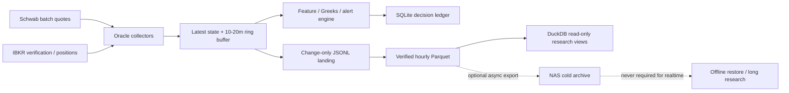

# ADR-0001: SPX 0DTE 市场数据采用 Oracle 单机优先存储

- Status: Accepted for Phase 1
- Date: 2026-07-11
- Scope: `spx-spark` 的实时采集、研究数据和本地保留策略
- Review trigger: 见“重新评估条件”

Related documents:

- [SPX Spark Data Platform](../data-platform-design.md)
- [Storage Plan](../storage-plan.md)
- [Data Source And Runtime Decision Memo](../data-source-decision.md)

## 背景

项目已经具备 Schwab Market Data API，并以以下账户实测能力作为容量设计输入：

- Quote API 最多约 120 次请求/分钟；
- 单次最多约 500 个 symbols；
- SPXW 0DTE 在 5 点执行价间隔下，ATM `+/-200` 约 162 个 Call/Put 合约；
- 即使扩大到 ATM `+/-500`，约 402 个 Call/Put 合约，仍可落入一个批次。

这使 Schwab 可以承担主要的 0DTE 报价覆盖，而 IBKR 降为账户/持仓、少量高价值合约校验和 Schwab 异常时的旁路来源。它同时带来新的本地写入压力：若把 500 个 symbol 在 1 Hz 下逐行原样写入 JSONL，一个 6.5 小时交易日约产生 1,170 万行。按照当前 JSONL 的实际平均行宽估算，未压缩落地量可达到约 13 GB/交易日。

当前 Oracle 数据盘约 126 GB，项目数据预算为 80 GB。实时数据必须在本地低延迟处理，但不应为了使用现有树莓派和 NAS，把家庭网络、Tailscale、NFS 挂载或额外控制面变成告警链路的前置依赖。

## 决策

Phase 1 采用 **Oracle 单机优先、NAS 延后、树莓派不进关键路径** 的拓扑：

1. Oracle 是实时采集、计算、告警和热数据持久化的唯一写入主机。
2. SQLite 只保存低频事务事实：事件、策略版本、决策、推送、结果和 compaction manifest。
3. ZSTD Parquet 是高容量历史报价和特征的持久数据主体。
4. DuckDB 是可重建的只读查询层，不作为实时数据库，也不保存第二份事实数据。
5. JSONL 只作为短期 landing buffer；常态报价采用 change-only 写入，完整 1 秒面板只在高价值事件窗口保存。
6. 树莓派和 NAS 暂不参与 Schwab 请求、实时状态、策略判断、告警发送或 SQLite 写入。
7. NAS 冷归档作为后续可选能力，只允许异步复制已经验证的不可变 Parquet 和报告；归档失败不得影响 Oracle 实时服务。
8. Oracle 不直接把实时数据写到 NFS，也不在 NAS 上运行活跃 SQLite/DuckDB 写事务。

这是一项 `spx-spark` 项目级决策。它不否定家庭实验室中“树莓派控制面 + NAS 长期存储”的通用设计，只明确该设计当前不适合进入 SPX 实时告警的关键路径。

## Oracle 本地路径约定

```text
/srv/data/spx-spark/data/latest/                         latest state
/srv/data/spx-spark/data/raw/                            short-lived JSONL landing
/srv/data/spx-spark/data/runtime/research-ledger.sqlite3 SQLite operational ledger
/srv/data/spx-spark/data/lake/                           verified immutable Parquet
/srv/data/spx-spark/data/manifests/                      compaction/deletion lineage
/srv/data/spx-spark/data/analytics/research.duckdb       rebuildable research catalog
```

SQLite、临时 compaction 文件和实时 latest state 都必须位于 Oracle 本地文件系统，不能放在 NFS 上。

## 目标数据流



## 数据分层和保留

| 层级 | 内容 | 写入策略 | Phase 1 保留 |
|---|---|---|---|
| 内存热状态 | 最新报价、provider 状态、10-20 分钟 ring buffer | 每次采样更新 | 进程生命周期 |
| JSONL landing | 标准化报价，不含不必要的完整 provider raw payload | change-only；15 秒 heartbeat | Parquet 验证后至少 24 小时 |
| 例行报价 Parquet | 选定 0DTE 合约及上下文 | 小时分区、ZSTD | 10 个交易日高分辨率 |
| 事件窗口 Parquet | Shock、reclaim、breakout、告警前后完整面板 | 事件前 5 分钟、后 15-30 分钟 | 90 天，后续按价值调整 |
| 特征 Parquet | GEX/DEX/DAGEX/VEX/CEX、wall、flip、skew、质量 | 1 秒/5 秒/1 分钟 | 1 秒 30 天；5 秒 90 天；1 分钟长期 |
| SQLite ledger | 事件、冻结特征、决策、推送、veto、MFE/MAE、manifest | 事务写入 | 长期 |
| DuckDB catalog | 对 SQLite 和 Parquet 的版本化视图 | 按需重建 | 不作为备份对象 |
| NAS 冷归档 | 已验证 Parquet、manifest、报告和可选 SQLite 快照 | 异步、幂等复制 | Phase 1 不启用 |

## Change-only 规则

常态轮询不等于每个 symbol 都有新市场数据。只有以下任一字段发生变化时，报价才写入 routine raw history：

- provider `quote_time` 或 `trade_time`；
- bid、ask、last、mark 或对应 size；
- volume 或 open interest；
- IV、Delta、Gamma、Theta、Vega；
- quality、delayed/stale 状态或 provider error；
- canonical contract metadata 或采样模式。

即使字段没有变化，每个活跃合约最多每 15 秒写一条 heartbeat，用来区分“市场未变化”和“采集器已经停止”。进入事件窗口时，写入策略可临时提升为每次成功采样都保存。

`received_at` 不得伪装成新的市场更新时间。freshness 仍以 provider 时间和 material fingerprint 为依据。

## 删除安全条件

JSONL 不能仅凭年龄删除。只有同时满足以下条件，closed-hour source 才能进入删除队列：

1. source 文件已经关闭且不再增长；
2. source size、mtime 和 SHA-256 已记录；
3. Parquet 已写入临时文件并完成 schema、row count、min/max timestamp 校验；
4. 最终 Parquet checksum 已记录到 manifest/SQLite；
5. 输出文件仍可读且 checksum 一致；
6. 已经过至少 24 小时 rollback grace；
7. 删除动作留有审计记录。

在 verified deletion 接线并完成至少一个完整交易日验证前，`DATA_PLATFORM_RAW_DELETE_ENABLED` 保持关闭。

## 80 GB 项目预算

| 用途 | 软预算 |
|---|---:|
| JSONL landing 与临时文件 | 10 GB |
| 例行报价 Parquet | 25 GB |
| 事件窗口与特征 Parquet | 25 GB |
| SQLite、报告、manifest、日志 | 5 GB |
| compaction scratch | 10 GB |
| 未分配的项目内余量 | 5 GB |

除项目 80 GB 软预算外，文件系统还必须始终保留至少 **25 GB 绝对可用空间**。项目预算、水位百分比和 25 GB reserve 三者中，采用最严格的限制。

沿用磁盘水位策略：

- 70%：告警并进入容量观察；
- 80%：优先 compaction，停止扩大采样面；
- 85%：降低 warm/outer 采样和 routine raw 写入；
- 90%：清理已验证、超过保留期的数据；
- 95%：停止非事件 raw 写入，只保留 latest、ledger 和关键告警。

## 故障边界

- NAS、树莓派、家庭宽带或 Tailscale 不可用时，Oracle 实时服务必须无感继续。
- SQLite 忙或研究写入失败时，允许写入有大小上限的本地 fallback spool；不得阻塞告警。
- DuckDB 查询、Parquet compaction 和未来 NAS export 必须运行在实时进程之外。
- compaction 失败时保留 JSONL，不得为了释放空间删除唯一副本。
- Oracle 数据盘不可写时，系统降级为 latest/alert 最小写入并发出高优先级运维告警。

## 暂不采用的方案

### Oracle 实时写 NAS/NFS

暂不采用。网络抖动、挂载状态、NFS 锁和家中断电都会扩大实时故障面，并可能影响 SQLite 和小时分区发布的原子性。

### 树莓派作为 SPX 控制面

暂不采用。当前只有一个实时 producer 和一个生产 checkout，引入任务 API、队列、重试、状态复制和双机部署的收益不足以覆盖运维成本。

### PostgreSQL 保存全部报价

暂不采用。高频追加报价更适合列式 Parquet；当前没有需要网络数据库协调的多 writer 事务。

### MacBook 保存完整副本

不采用。MacBook 会随身移动，不适合作为持续在线的数据主机。只允许按需下载研究分区或报告。

### 长期保留全部 1 Hz 500-symbol 快照

不采用。常态重复行的研究价值有限。优先保留 change-only 数据、固定间隔特征和完整事件窗口。

## 影响

正面影响：

- 实时路径只依赖 Oracle 本地进程和本地盘，部署与排障最简单；
- Schwab 的大批量报价能力可以用于完整面板，而不会迫使系统同步扩张存储；
- SQLite、Parquet、DuckDB 各自承担适合的角色；
- 将来接入 NAS 只增加归档能力，不需要重写实时系统。

负面影响：

- Phase 1 中 Oracle 仍是实时和近期历史数据的单点；
- 在 NAS 异步归档启用前，灾难恢复点取决于 Oracle 自身备份；
- change-only 需要正确的 fingerprint 和 heartbeat，否则可能错误丢弃有意义的更新；
- 事件分类错误可能导致某些高分辨率窗口没有被长期保留。

## 重新评估条件

满足任一条件时重新评估 NAS 或独立存储节点：

- `/srv/data` 连续 5 个交易日低于 25% 可用空间；
- 项目有效数据持续超过 50 GB，且保留策略无法满足研究需求；
- 需要保留超过 90 天的高分辨率完整面板；
- 出现第二个独立 producer 或多个并发写入主机；
- 研究工作需要跨机器共享超过 100 GB 的 Parquet；
- 灾难恢复目标要求 RPO 小于 24 小时；
- NAS、树莓派和网络路径完成至少 30 天稳定性验证，并且归档收益明确。

即使触发重新评估，首选演进路径仍是“Oracle 本地写入 -> 已验证 Parquet 异步复制到 NAS”，而不是让实时 collector 直接写 NFS。

未来树莓派可以承担外部存活探测或发起异步归档任务，但不能拥有 quote state、执行 compaction、路由实时告警或成为 Oracle 继续运行的必要条件。

## 实施顺序

1. 为 Schwab 批量采集增加 canonical symbol registry 和共享 rate governor。
2. 在 quote landing writer 中加入 material fingerprint、change-only 和 heartbeat。
3. 保持每小时小批 ZSTD Parquet compaction；周六和周日 08:30 CST 运行低优先级 bulk catch-up。
4. 增加事件前后 ring-buffer preservation。
5. 运行至少一个完整交易日，核对 row count、覆盖率、压缩率和磁盘增长。
6. 在 verified raw deletion 接线前，周日 13:00 CST 的 retention job 只做非破坏性审计；接线后的初始 grace 为 24 小时。
7. 只有在重新评估条件触发后，才设计 NAS 异步冷归档；树莓派仍不自动成为关键控制面。
