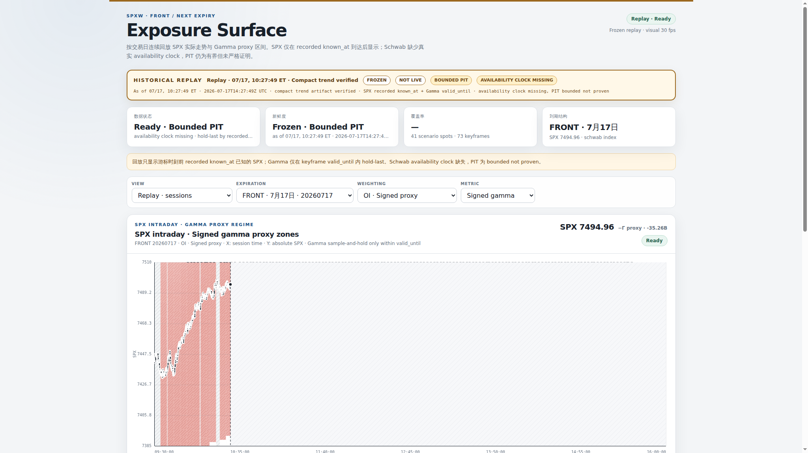
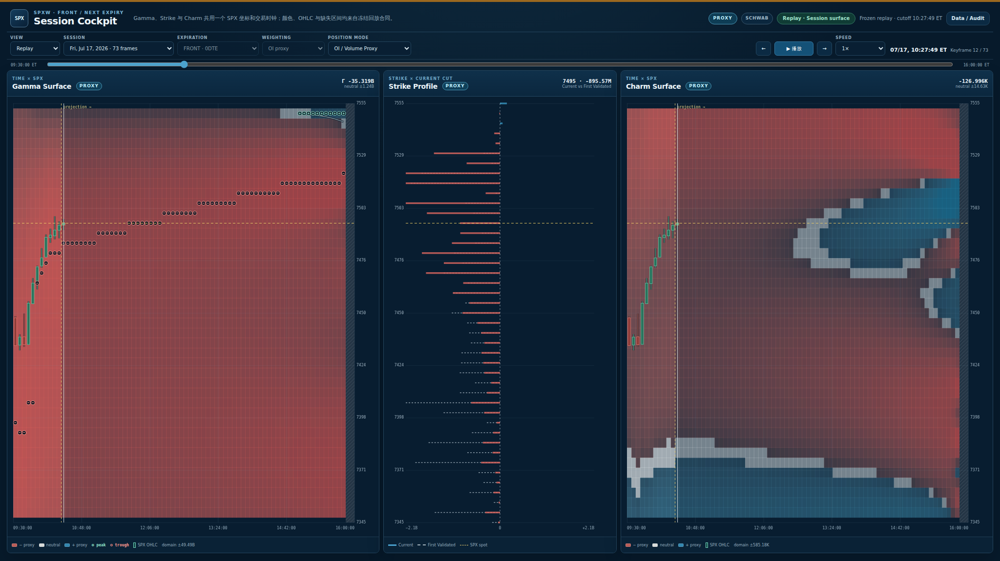
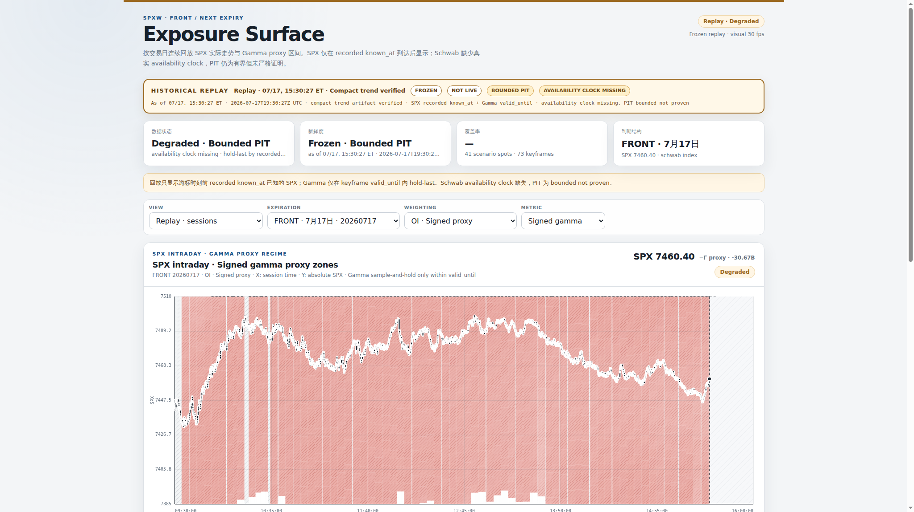
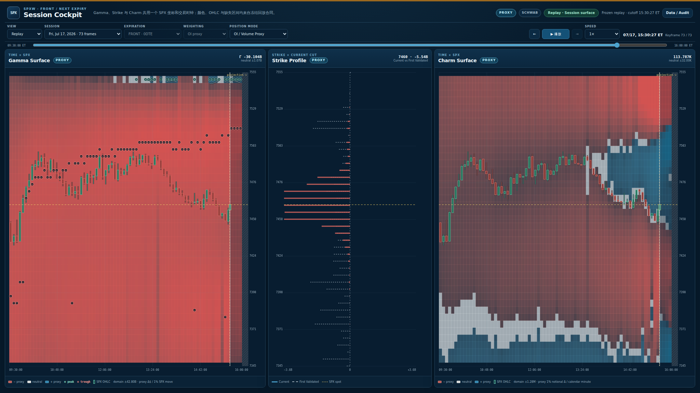

# SPXW Exposure Trading Cockpit 验收报告

日期：2026-07-19

验证交易日：2026-07-17

分支：`agent/strategy-hotpath-reliability`

改造前基线 HEAD：`4880722c9c4273d1b9958d05e26a0dd6b1adc436`

## 结论

Replay 页面已从逐帧 `Now/+5m` 情景报告改造成固定 Session Canvas：Gamma、Current/First Validated Strike Exposure Proxy、Charm 三栏默认同屏，使用相同 SPX 价格纵轴，并叠加仅截至回放 cutoff 的 SPX K 线。历史列冻结，当前 cutoff 右侧明确标为 projection；缺失值保持 `null` 并以斜纹显示，不以零值补齐。

当前实现仍是 OI/Volume Exposure Proxy，不是 Market Maker、Dealer 或 participant 实际仓位。Live publisher 还没有固定 session-grid accumulator，因此 Live 页明确显示不可用占位，不把移动 scenario grid 伪装成固定历史曲面。

## 实际运行入口

- 前端入口：`site/spxw-surface/public/index.html`、`app.js`、`styles.css`
- 部署：`site/spxw-surface/compose.yaml` 将 `site/spxw-surface/public` bind mount 到 Nginx 容器
- 外部入口：`https://spx.zh3nyu.com/replay`，由 code-server 认证保护
- Replay 服务：用户级 `spx-spark-surface-replay.service`
- 服务入口：只读 Unix socket `/srv/data/spx-spark/data/published/spxw-surface/runtime/replay-api.sock`
- Nginx 容器：`spxw-surface`，code-server network namespace 内端口 `18082`
- Live publisher：`spx-spark-surface-dashboard.service`

## 数据契约变化

新增接口：

```text
GET /api/v1/replay/sessions/{date}/session-surface
  ?at={ISO-second}
  &role=front|next
  &weighting=oi_weighted|volume_weighted
  &bucket_minutes=5|10|15
  &price_step=2.5|5|10
```

`spxw_session_surface` v1 返回：

- 固定 `session_start` / `session_end`、`as_of`、expiry；
- 共用 `time_buckets` 和 `price_grid`；
- nullable Gamma、Charm、Vanna、Gross Gamma 矩阵；
- 每列 `historical`、`projection` 或 `missing` 语义；
- causal、cutoff-bound 的 OHLC candles；
- Gamma zero ridge、positive peak、negative trough；
- Current 与 First Validated strike profile；
- `missing_ranges`、provenance、capabilities 和内容 SHA-256。

默认网格为 09:30–16:00 ET、5 分钟、5 SPX 点，2026-07-17 响应为 78 个时间桶 × 41 个价格点。价格网格锚定该 session 首个 causal SPX 观测，不随每帧跳动。

能力标志固定为：

```text
proxy_position_available=true
participant_position_available=false
open_close_available=false
signed_flow_available=false
```

页面和接口因此只使用 `Current OI Exposure Proxy`、`First Validated` 等标签。当前数据湖没有精确开盘 OI，所以没有冒充 `Start of Day`。

## 页面与交互

- 2048×1150 首屏同时显示 Gamma、Strike、Charm；页面本身无滚动。
- 左右曲面较宽，中间 profile 较窄，三个 plot 的顶部、底部和 SPX Y 映射一致。
- 三栏共享 hover price、十字线、current SPX line 和 tooltip 状态。
- 当前时间以竖线标记；右侧 projection 使用边界、透明度和标签区分。
- 实际 K 线只画到 `as_of`，未来 hover 不借用最近一根未来/历史 candle 伪装 OHLC。
- 30 fps 只用于 Canvas 动画；市场数据仍按实际事件和五分钟 surface cutoff 更新。
- 静态网格/曲面与动态 overlay 分层；请求 single-flight 并合并积压 cutoff，不触发整页重渲染。
- 色域为 cutoff 当时数据的对称绝对 p98，并在正向播放时只扩不缩；原始值保留在 tooltip。
- 零值为中性色、正 Gamma/Charm 为蓝色、负值为红色；缺失区域为斜纹。
- Audit/Data drawer 保留 Frozen、Bounded PIT、availability clock、provenance、参数、缺口和统计。

## PIT 与数据完整性验证

### 10:27:49 ET

- cutoff：`2026-07-17T14:27:49Z`
- 78×41；11 historical、65 projection、2 missing
- 12 根 causal candles；92 个 strike profile rows
- `no_future_columns=true`
- `no_future_candles=true`
- `historical_bucket_causal=true`
- `projection_after_cutoff=true`
- missing cells 保持 `null`

### 15:30:27 ET

- cutoff：`2026-07-17T19:30:27Z`
- 78×41；72 historical、4 projection、2 missing
- 73 根 causal candles；84 个 strike profile rows
- 同样通过 no-future、causal、projection-boundary 和 missing-null 检查
- 完整当天历史仍保留，收盘前没有因 `+30m/+1h` 越界形成大块无意义空白

当前源只提供 `bounded_not_proven` PIT，availability clock 不可用。页面持续显示这一限制；验证结果不把它升级成 point-in-time proven。

## 截图

### 10:27:49 ET

改造前：



改造后：



### 15:30:27 ET

改造前：



改造后：



四张截图均为 2048×1150。浏览器验证中三个 Canvas stage 的 `top=198`、`bottom=1100`、`height=902` 完全一致，document 与 viewport 同为 2048×1150。

## 测试结果

- Python 全量测试：`1744 passed, 1 warning`；warning 为上游 websockets deprecation。
- Session Surface、部署、站点与架构定向测试：`65 passed`。
- JavaScript contract tests：通过。
- `node --check site/spxw-surface/public/app.js`：通过。
- Ruff：通过。
- `git diff --check`：通过。
- 覆盖：坐标正反变换、固定共享 grid、PIT/no-lookahead、首帧前 fail-closed、partial candle cutoff、missing-null、metric units、稳定/回退重置色域、极端值 p98、连续 keyframe playback、能力标志和部署契约。

## 性能结果

73 个默认 cutoff 全部预热后，在部署版本从 10:27:49 ET 以 4× replay 连续运行 13.005 秒，市场时钟到 12:29:49 ET：

- dynamic Canvas paints：385，`29.60 fps`
- static surface paints：播放中 23，排空最终请求后 24
- DOM nodes：295 → 295
- 跨越 24 个 validated keyframe，发出 24 个唯一 session-surface 请求；顺序逐项一致，`missing=[]`、`duplicates=[]`
- 最终 surface cutoff 与 playhead 同为 12:29:49 ET，无 loading/pending
- JS heap 强制 GC：1,708,790 → 1,954,092 bytes，保留增量约 0.23 MiB
- Console 与 page errors 均为空
- 73 个默认 cutoff 全量预热并完成浏览器回放后，Replay 服务 RSS 约 107.2 MiB、峰值 109.1 MiB；systemd `MemoryHigh=1 GiB`、`MemoryMax=2 GiB`

API 实测：

- 10:27 首次构建 5.816 s / 303,244 bytes；缓存命中 0.147 s
- 15:30 首次构建 5.018 s / 317,014 bytes；缓存命中 0.141 s

Canvas 播放已达到约 30 fps；冷构建仍约 5–6 秒。默认交易日 post-close warmer 现在预热所有默认 front/OI/5m/5pt cutoff，以避免历史回放落到冷路径。若请求未预热，playhead 会停在下一 validated cutoff 等待验证，不会跳过市场状态。Canvas base 在两个 cutoff 之间持续复用；每个新 cutoff 仍重画一次 78×41 base，而不是实现逐列 dirty-rectangle 更新。实测该路径不影响约 30 fps，因此本轮没有引入 WebGL。

## 仍属于 Proxy 的部分

- Gamma、Charm、Vanna、Gross Gamma 都由 OI/volume proxy 与 Greeks 计算。
- 正负颜色表示 proxy exposure 的数学符号，不代表已知 Dealer/MM inventory 方向。
- First Validated 是当天最早有效快照，不是精确 SOD OI。
- candles 来自截至 cutoff 可用的 SPX 观测，不是交易所逐笔全量 tape。

## 外部数据与后续阻塞项

以下能力不能由当前 Schwab lake 推断，必须接入 participant-tagged、open/close、buy/sell 或可审计仓位账本：

- Market Maker / Dealer 实际仓位；
- participant type 分解；
- signed flow；
- open/close 分解。

Live 与 Replay 共用同一固定 contract 还需要服务端 durable live session accumulator。这不是 participant 外部数据阻塞，而是尚未完成的内部架构项。当前五秒 publisher 只覆盖 latest moving-grid snapshot，无法恢复已覆盖的盘中历史；今天又是非 RTH，不能完成真实盘中 rollover、断档、重启恢复和 lease 验收。前端因此 fail closed，不会将移动网格补零或伪造成 Session Canvas。

接口已支持 5/10/15 分钟与 2.5/5/10 SPX 点配置；当前页面固定使用验收默认值 5 分钟 × 5 点，尚未在工具栏暴露这两个高级选择器。

## 部署与回滚

部署检查：

```bash
systemctl --user restart spx-spark-surface-replay.service
docker compose -f site/spxw-surface/compose.yaml restart spxw-surface
curl --unix-socket /srv/data/spx-spark/data/published/spxw-surface/runtime/replay-api.sock http://localhost/healthz
docker inspect --format '{{.State.Health.Status}}' spxw-surface
```

回滚使用一次可审计的 revert，不覆盖工作树：

```bash
git revert --no-commit 4880722c9c4273d1b9958d05e26a0dd6b1adc436..HEAD
git commit -m "revert: remove SPXW session exposure cockpit"
systemctl --user restart spx-spark-surface-replay.service
docker compose -f site/spxw-surface/compose.yaml restart spxw-surface
```

Session Surface cache 以 contract、policy、source 和 timeline fingerprint 隔离；回滚后旧服务不会读取新 contract cache，因此不需要破坏性删除缓存。
