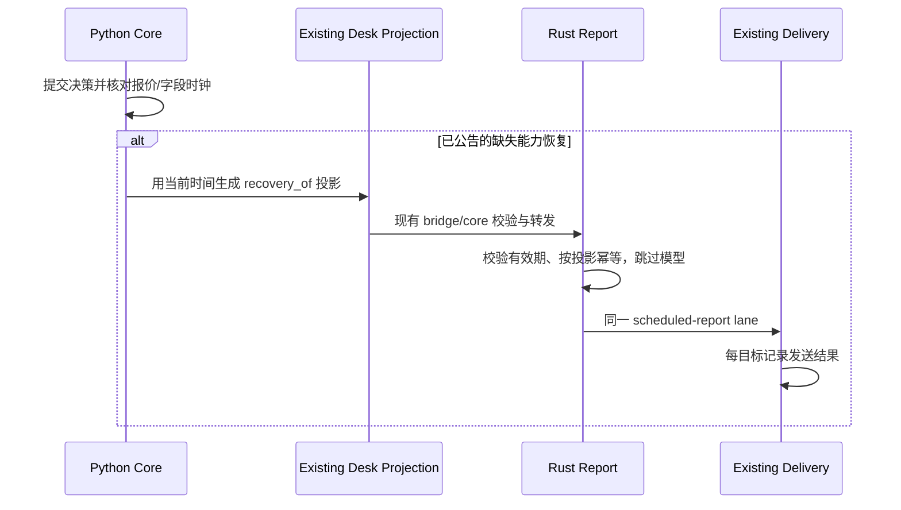

# Notification architecture

<!-- documentation-status: 2026-10-05 -->
> **文档定位：现行运行与参考。** 现行说明；历史段落保留原适用日期。运行状态以实际服务和源字段时钟为准。
> [全仓文档、当前运行状态与合同优先级](README.md)（目录核对：2026-10-05）。

## 当前 owner 与消息事实

Python 最终策略来自 `build_strategy_decision`，人工候选通过既有 Python
通知路径交给 Huey Worker。半小时 Desk Map 与数据恢复摘要由 Python 准备
`desk_map_projection.v1`，交给既有 Rust bridge/core/report/ledger/delivery。
Phase 6 Rust 退役已延期；不能根据历史迁移设计另建 owner 或恢复旧 outbox。

| 消息 | Producer / scheduler | 持久化与发送 |
| --- | --- | --- |
| 人工候选、Python 业务提醒 | 既有 Python 策略/业务模块 | Python operational DB `notification_events` / `notification_attempts`，Huey 工作任务 |
| 定时桌图 | Python 状态快照 + Rust `:00/:30` ET scheduler | Rust SQLite/WAL ledger、scheduled-report intent、每目标回执 |
| 数据恢复桌图 | Core 发现新鲜能力恢复，重新准备当前摘要 | 同一 Rust lane，`recovery:<projection_id>` 幂等，跳过模型写手 |
| 系统故障/恢复 | 既有 Worker 每分钟监测 | 直接飞书提醒，不依赖 Rust report 链路 |

`SPX_RUST_REPORT_OWNER` 与 Rust 配置/CLI/owner marker 共同维持既有单 owner
边界。正常部署保留当前 owner；样例配置中的 `network_enabled=false` 不是
生产投递停用的证据。Bark transport、配置与投递规则保持不变。

## 语义边界

| Lane | 含义 | 不代表 |
| --- | --- | --- |
| `ops_transition` | 数据源/运行状态变化 | 入场授权 |
| `market_warning` | 已确认的市场提醒 | 自动反向或新仓 |
| `trade_ready` | 完成适用门禁的人工候选 | 已验证长期 edge、自动下单或已经成交 |
| `position_safety` | 在明确启用且标明环境的持仓可见性下管理风险 | 未知账户为空仓、Paper 等于真实账户 |
| `scheduled_report` | 定时/恢复行情与策略摘要 | 该摘要中所有能力都已恢复 |

所有候选 `automatic_ordering=false`。NO_TRADE 是不建立新风险，已有仓位仍需
独立管理。策略状态、通知入队/送达和真实成交是三个不同事实。

## Python 通知实现

现行存储与执行 owner 是：

- `infrastructure/notifications.py`：每冻结目标一条通知事件、幂等与取消记录。
- `notifier/unified_delivery.py`：有效期、取消/并发、transport 与恢复处理。
- `infrastructure/jobs.py`：Huey task、启动恢复和既有重试调度。

事件状态为 `pending`、`processing`、`delivered`、`failed`、`uncertain`；
各目标的 attempt 单独记录。启动恢复不能把未知网络结果自动当成成功，
也不能在重试时改变原目标或经济机会。具体事务与调度以这些 owner 代码为准。

早期独立 delivery worker、receipt mirror 与 JSONL missed-queue 的迁移步骤
已经完成，不是当前安装指南。历史设计和切换证据分别见
[Phase 4 cutover](change-brief-p4-2-notification-cutover.md)与
[operational DB](change-brief-p5-1-s6-operational-db.md)。

## Desk Map 时间与恢复

定时源快照、当前策略决策、报价有效期、最终报告和手机回执分别保留时钟。
报告复用已提交策略，慢工作前冻结、入队前重新校验；不重新读取变化中的 latest
来制造另一份同名最终策略。

2026-10-06（S1/S3、Phase 6 故障修复）：报告开始时和模型返回后，检查当前
同 session、交易日、时段的有效恢复投影。定时卡尚未入队时，使用恢复投影的
完整、已验证事实，替换旧摘要并占用原定时槽；不拼接两份策略或再次计算策略。
账本通过 `source_projection_id` 识别已合入定时卡的恢复，重启后不会另发一张。
定时卡已入队后产生的不同恢复投影仍可即时补发，没有增加等待或冷却。
两翼铁鹰扫描与历史统计在结论区各展示一次，策略状态区只补充授权/阻断状态。

数据恢复流程按 10/20 点翼的报价与概率独立检查，OI 未验证不妨碍已合格铁鹰
数据的更新。但新鲜 BBO 不会刷新另一条腿或 Greeks 的年龄；缺 Delta 时没有
选齐结构，不能生成概率。独立恢复补发不更新定时报告的成功时钟来掩盖漏报；
合入尚未发送定时卡的恢复则履行该定时槽，并记录定时成功。
恢复投影作为 latest 地图沿用 RTH 20 分钟/GTH 65 分钟快照期限；恢复消息的
准入与 outbox 到期独立限制为发布后两分钟，不能用消息 TTL 提前作废整个地图。
当前 API 字段缺口与接入验收见[2026-10-05 记录](desk-data-recovery-2026-10-05.md)。

2026-10-09 补修：同一翼宽报价恢复而历史仍为 `history_preparation_pending` 时，
不单独推送这一步计算进度；原后台计算完成后立即合并报价/概率恢复，不新增等待
定时器。历史已明确失败（如 quote gap）仍可报告真实报价恢复及概率不可用；
其他执行数据能力恢复不被研究等待挡住。前后两次读取均检查这一条件。
独立 `recovery:` intent 保留完整审计消息，发送排版只显示结论、当前结构/概率、
执行与数据状态，去掉固定 RTH 基准、图链、墙位与触发说明的整卡重发。
布局由现有持久化 slot 决定，不靠标题猜测；合入定时槽的恢复仍发完整桌图，并
去掉“数据恢复更新”后缀。正常半小时桌图保留两种翼宽及各自固定基准。
Bark transport、目标、重试、通知幂等和所有交易门槛均未改变。

报告保存不等于送达；transport 成功回执也不等于用户已阅读。
策略回测与归因从原始 IBKR/Schwab 数据重建，通知记录仅支持运行链路核验，
不得筛选策略样本或充当收益标签。本次文档更新不读取 Bark 数据做归因。
