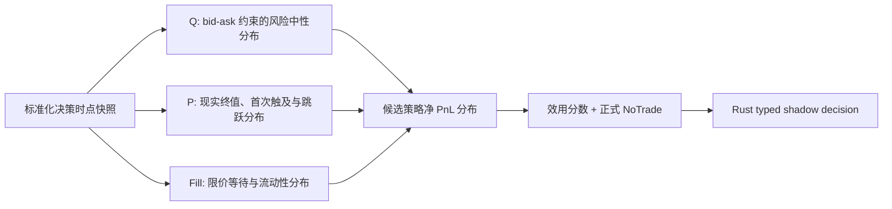

# SPX 0DTE 概率模型：从市场隐含分布到可执行净收益

> **状态（2026-08-07）：本研究设计的第一版工程化落地由
> `docs/strategy-signal-engine-v2.md` §13–§14 规定（S-track S4）。**
> 两文冲突时以 v2 为准；本文其余部分作为研究背景继续有效。

状态：研究设计，立即进入 shadow 迭代；不构成已验证 edge，不改变
`automatic_ordering=false`。

## 技术结论

我们不应该继续把问题压缩成一个“上涨概率”或一个 HMM state。目标应拆成五层：

1. 从期权链提取风险中性测度下的市场隐含分布 Q；
2. 估计现实测度下的终值与路径分布 P；
3. 估计给定限价策略的成交、等待、撤单和 adverse selection；
4. 对每个候选策略生成扣除执行成本后的完整净收益分布；
5. 把 `NoTrade` 与 Call、Put、vertical 等候选放在同一决策集合中比较。



真正值得研究的 edge 是：

```text
现实条件概率 P 与市场隐含概率 Q 的差异
− 可成交价格与等待成本
− 手续费、点差和滑点
− 尾部风险与模型不确定性
```

更好的 surface fit 主要得到更可靠的 Q，不是自动得到更准确的 P；
更好的 Greeks 主要改善风险解释，也不等于扣除成本后的 Alpha。

## 当前系统应保留什么、替换什么

| 当前能力 | 判断 | 这次演进 |
|---|---|---|
| `analytics/options/density.py` 的 synthetic mid 二阶差分、负质量 clipping | 可作 differential baseline，不能作新模型的最终 Q | 替换为 bid-ask 约束、无套利、带完整诊断的 `q_density.v2` |
| `analytics/options/probability.py` 的 $N(d_2)$/Delta fallback 与 `2 × terminal` touch heuristic | 保留为风险中性审计基线，不是 physical first-touch | 增加两边界、有限 horizon、jump-aware 的 P 路径模型 |
| `research_context.v2` 的 causal filtered HMM posterior/entropy | 保留 | 作为 P 模型 feature/mixture weight；不解释成做市商行为 |
| bootstrap close/high/low quantiles | 可立即 shadow，但未校准 | 由 walk-forward physical heads 逐步替代，继续明确 distribution semantics |
| opportunity replay 的 exact ask/bid、`quote_reached` 与成本敏感性 | 保留并复用 | 新增 order-at-risk lifecycle，单独训练真实 fill/cancel/partial 模型 |
| Rust `NO_TRADE` / `MANUAL_CANDIDATE` typed action | 保留 | 增加有界的 score decomposition、signed PnL 与正式 NoTrade reason contract |

这意味着不需要推倒已有的 causal/replay/Rust 边界；需要替换的是概率估计器和标签语义，
并把五层结果通过新版本契约串起来。

## 记录并收敛原始 idea

### 模型二：净收益分位数

保留用户提出的三个对外核心输出：

```text
p10_net_pnl
p50_net_pnl
p90_net_pnl
```

其中左尾比平均值更重要：

\[
Q_{0.10}(Y_j\mid X_t)
\]

$Y_j$ 是候选策略 $j$ 在真实执行策略下的净收益，而不是使用 mid
假设得到的理论收益。第一版可以使用线性 Quantile Regression 和 LightGBM
Quantile 作基线与 challenger，但训练时不应只拟合三个点。为了估计 Expected
Shortfall，至少保存

\[
\alpha\in\{0.01,0.05,0.10,0.25,0.50,0.75,0.90,0.95,0.99\}
\]

的分位数，或直接拟合一个完整条件分布。独立 LightGBM quantile head 可能发生
quantile crossing，必须记录 crossing rate，并通过单调约束、rearrangement 或
distributional model 修正。

当前 `research_context.v2` 的 `QuantileBand` 只允许正数，适用于 SPX 价格区间，
不能复用于有正有负的 PnL。净收益契约需要独立的 signed quantile type，并明确
`USD_per_1_contract` 或 `option_points_per_spread` 单位。

### 模型三：成交概率与等待时间

用户提出的目标保留为：

\[
P(T_{fill}\le h\mid X_t,\ell)
=1-\exp\left(-\int_0^h\lambda_{fill}(u\mid X_t,\ell)du\right)
\]

其中 $h$ 是允许等待时间，$\ell$ 是限价相对 NBBO/mid 的位置。这个等式只适用于
`fill` 是唯一终止原因的单一 hazard。若撤单、超时、追价和被动成交互相竞争，则必须使用
competing-risk 累计发生率：

\[
S(u)=\exp\left(-\int_0^u\sum_k\lambda_k(v)dv\right),\qquad
F_{fill}(h)=\int_0^h S(u)\lambda_{fill}(u)du
\]

实现分两级：

- 固定 2/5/10/30/60 秒 horizon 的 Logistic Regression 与 LightGBM，建立容易审计
  的概率基线；
- competing-risk survival model，联合预测被动成交、撤单/超时、追价成交与未成交。

需要严格区分两种标签：

- `displayed_quote_reached`：quote lake 中 ask/bid 到过限价；
- `actual_order_filled`：真实订单有提交、确认、部分/全部成交记录。

当前 replay 已正确把前者称为 `quote_reached`，不能拿它训练并声称“真实成交概率”。
在没有订单提交与撤单日志时，我们只能得到 displayed-liquidity 上界或代理；真实 fill
模型需要导入人工/IBKR activity 的 order lifecycle，或设计明确授权的 paper/manual
采样。没有真实 order-at-risk 的机会，不能被伪造为 no-fill 样本。

### 正式决策函数

令 $Y_j$ 为策略 $j$ 的净收益。为正确处理未成交为零、vertical 最大亏损等离散概率
原子，使用分位数积分定义正数形式的左尾损失：

\[
TailLoss_{\alpha,j}
=\max\left(0,-\frac{1}{\alpha}\int_0^\alpha Q_u(Y_j)du\right)
\]

则：

\[
Score_j=E[Y_j]-\lambda TailLoss_{\alpha,j}
-\eta ModelUncertainty_j-\zeta LiquidityRisk_j
\]

并把不交易定义为一个真实候选：

\[
Score_{NoTrade}=0
\]

\[
j^*=\arg\max_{j\in\mathcal J\cup\{NoTrade\}} Score_j
\]

非 `NoTrade` 候选只有在数据 READY、分数或其保守置信下界超过版本化阈值时才可成为
shadow manual candidate。否则必须输出明确原因，例如：

- `negative_net_utility`；
- `edge_vs_q_too_small`；
- `fill_probability_too_low`；
- `tail_loss_too_large`；
- `model_uncertainty_too_wide`；
- `surface_or_exact_quote_degraded`。

`NoTrade` 不是模型报错、缺省值或“没有想法”，而是可被回测、计数和归因的正式策略。

## 当前 Oracle 数据允许我们声称什么

2026-08-05 的冻结审计快照显示：98 个独立方向事件覆盖 14 个交易日，在
30/60/180/300 秒 horizon 上有 388 个完整 outcome；但真实 `orders_at_risk=0`，当前
policy 的严格净 PnL 训练样本也是 0。displayed quote-reach 只有 13 个无冲突样本，覆盖
6 个交易日。

因此当前只允许发布“未校准 physical follow-through shadow”：

- 98 个事件不能当作 388 个独立样本；重叠 horizon 与同日事件必须聚类并 purge；
- 当前 terminal direction 标签不能冒充 `target_first/stop_first/neither`；
- quote reached 不能冒充 actual fill；
- 没有真实成交样本时，不训练 fill survival、净 PnL quantile 或 ES selector；
- 当前 notebook 是冻结 JSON 的可执行一致性检查，不等同于可从 Oracle 原始表重建的完整
  lineage 审计；正式训练前需固定查询、输入清单及 hash，并按日期/session 分层。

## P 与 Q 的正确关系

市场期权价格近似为：

\[
V_t^{mkt}=e^{-r\tau}E^Q[\Pi(S_T)]
\]

我们真正关心的是现实世界测度下、使用可成交权利金的策略价值：

\[
EV_j^{net}(X_t)
=e^{-r\tau}E^P[\Pi_j(S_T,Path)\mid X_t]
-Premium_j^{exec}-Fees_j-Slippage_j-OpportunityCost_j
\]

原 idea 中的 $P_j^{exec}$ 容易与 probability P 混淆，因此统一改名为
`Premium_j_exec`。

可以单独报告分布差异：

\[
DistributionEdge_j
=E^P[\Pi_j]-E^Q[\Pi_j]
\]

但不能在同一个 EV 中既减去完整市场权利金，又重复减一次 $E^Q[\Pi_j]$。市场
premium 已经包含 Q 定价、风险溢价和微观结构成本；P−Q 是解释 edge 的诊断，
不是额外重复扣款项。

## 论文 6–10 如何重构 surface、尾部与事件风险

| 顺序 | 论文给出的能力 | 对系统的直接改动 | 不能声称什么 |
|---|---|---|---|
| 6 | [0DTE Option Pricing](https://papers.ssrn.com/sol3/papers.cfm?abstract_id=4503344) 用 local-in-time、Edgeworth-like 展开刻画 skew、kurtosis、leverage 与 vol-of-vol | 不再只保存 ATM IV；输出 `q_skew`、`q_kurtosis`、`q_vol_of_vol`、尾部质量，并作为 P 的特征 | 更好的报价/Greeks 拟合不是方向 edge |
| 7 | [Ultra-short-term Volatility Surfaces](https://arxiv.org/pdf/2603.29430) 表明相邻超短期限 ATM IV 会强烈振荡 | 每个 expiry 独立拟合 smile；显式保存剩余交易分钟、结算时钟与 event-spanning，再做跨期限一致性 | 不能把 0/1/2DTE 粗暴平滑成普通 term structure |
| 8 | [Intraday Jumps and 0DTE Options](https://papers.ssrn.com/sol3/papers.cfm?abstract_id=5223127) 用 stochastic volatility + Poisson jumps 分解扩散、波动率与跳跃风险 | 为 P 路径增加 time-of-day jump hazard；first-touch simulation 必须允许跳跃 | jump premium 大不表示下一跳方向，也不保证买尾部盈利 |
| 9 | [Non-Spanning Identification of Scheduled Event Risk](https://arxiv.org/pdf/2606.12872) 用非跨事件合约固定 no-event surface，再用跨事件训练合约识别 jump，并留出跨事件合约评估 | CPI/FOMC/NFP 分类型；保存 `event_at`、`minutes_to_event`、`spans_event`；no-event/event train/event holdout 三组不可混用 | 把跨事件报价放进基础 surface 后得到的好拟合可能只是吸收了 event premium |
| 10 | [From Arbitrage Removal to Density Extraction](https://arxiv.org/pdf/2605.22792) 将 bid-ask 作为原始约束，先去除可执行静态套利，再以平滑/熵约束提取密度 | 用 bid-ask 约束的 convex fit/ARIES-like filter 取代 raw-mid 二阶差分；SEDEx 作为 challenger | clipping 负密度再归一化不能证明得到有效市场概率 |

这些论文包含 working paper/preprint；它们用于提出可证伪的工程与模型假设，不直接构成
我们系统已有 edge 的证据。

### Q 层：先修复报价，再提取概率

Breeden-Litzenberger 仍是基础：

\[
q_t(K,T)=e^{r\tau}\frac{\partial^2 C_t(K,T)}{\partial K^2}
\]

但不能直接对原始 mid 做二阶差分。当前
`src/spx_spark/analytics/options/density.py` 正在使用 synthetic call mid、非均匀二阶
差分、负质量 clipping 和正质量归一化；它的 `clipped_mass_fraction` 是诚实诊断，
却不应继续作为新概率模型的最终估计器。

目标 `q_density.v2` 流程：

1. 以决策时点 exact bid/ask、source timestamp、quote age、size/depth 为输入；
2. 删除 crossed、non-positive、过宽、陈旧、异步和 underlier/expiry 不一致的报价；
3. 用 put-call parity forward 统一 OTM Call/Put，不使用简单 $r\approx0$ spot parity；
4. 在每个 expiry 内执行 bid-ask 约束的单调、凸性和边界拟合；
5. 对可执行静态套利做 ARIES-like 诊断与最小信息损失删除；
6. 由无套利价格曲线或 SEDEx-like density-first 方法生成非负、归一的 Q；
7. 每个 expiry 通过后，才评估跨期限 calendar consistency。

每个 Q artifact 必须携带：

- 输入 strikes、双边率、quote age/skew 和 strike coverage；
- bid-ask envelope violation 数量与最大幅度；
- monotonicity、convexity 和 executable-arbitrage removal 记录；
- density mass、forward moment error、tail support 与 regularization sensitivity；
- 被删除/保留 strike 的稳定 lineage；
- `distribution=risk_neutral`，不得标为 physical forecast。

SVI/SSVI 可以做受约束的 benchmark 或 challenger，但不能仅因参数化名称就视为无套利。
第一步更重要的是价格落在 bid-ask 可行域、call 曲线单调凸、密度非负且质量诊断完整。

### P 层：预测现实终值，也预测路径顺序

第一版不需要从完整 Heston/PIDE 开始。先使用可校准、可解释的监督模型：

- 终值 buckets：例如收于关键位下方、区间内、上方；
- close-location：下/中/上三段；
- first-touch competing outcomes：`target_first`、`stop_first`、`neither_before_expiry`；
- jump head：给定剩余 horizon 的 jump/no-jump 及左右尾 buckets。

为了直接研究 P−Q，可使用风险中性概率作 offset：

\[
\operatorname{logit}P^P(A\mid X_t)
=\operatorname{logit}P^Q(A\mid X_t)+g_A(X_t)
\]

其中 $g_A$ 学习现实历史相对市场隐含概率的校正，而不是重新从零拟合市场已知的信息。
必须同时保留不使用 Q 的模型和 `P=Q` 基线作 ablation。

路径模型至少采用 mixture：

\[
P(Path\mid X_t)
=(1-p_{jump})P_{diffusion}+p_{jump}P_{jump}
\]

其中 `p_jump` 依赖 session、距开/收盘分钟数、事件倒计时、realized volatility、
跨指数状态和 causal HMM posterior。复杂 stochastic-vol/jump Monte Carlo、PDE/PIDE
和 Edgeworth++ 是后续 challenger，不阻塞基线实时 shadow。

### 首次触及公式校正

对

\[
dX_t=\mu dt+\sigma dW_t,\quad L<x<U
\]

先触及上界 $U$ 的概率为：

\[
P_x(\tau_U<\tau_L)
=\frac{1-e^{-2\mu(x-L)/\sigma^2}}
       {1-e^{-2\mu(U-L)/\sigma^2}},\quad \mu\ne0
\]

当 $\mu\to0$ 时：

\[
P_x(\tau_U<\tau_L)=\frac{x-L}{U-L}
\]

因此 SPX 7700、止损 7690、目标 7720 的零漂移结果确实是 $1/3$，但正确公式是
$(7700-7690)/(7720-7690)$，不是倒置的 $(U-L)/(x-L)$。真实 0DTE 必须再加入
有限 horizon、时变波动率、离散跳跃和 overnight/session 边界，通常用 Monte Carlo 或
PIDE 求解。

## 论文 11、13、14 如何建立真实执行模型

| 顺序 | 论文给出的能力 | 对执行模型的直接改动 |
|---|---|---|
| 11 | [Hope at a Reasonable Price](https://www.sec.gov/files/dera-hope-reasonable-prc-2503.pdf) 研究客户 non-marketable limit order 与短暂等待后再主动成交 | 比较 `cross_now`、`passive_then_cancel`、`passive_then_cross`；使用成交前有效 BBO，先解决 quote-trade sequencing |
| 13 | [Risky Intraday Order Flow and Option Liquidity](https://paolapederzoli.com/wp-content/uploads/2025/07/risky_order_flow_jfqa.pdf) 将短期期权流动性与日内 order-flow volatility、库存/匹配风险联系起来 | 将 order-flow dispersion、spread/depth、quote update intensity 与跨 venue/合约流动性状态加入 hazard；不能只用 Delta hedge cost |
| 14 | [The Rise of Algorithmic Retail Option Traders](https://papers.ssrn.com/sol3/papers.cfm?abstract_id=6480379) 记录 SPX 0DTE 整点/半点数秒内的规则化多腿订单尖峰 | 加入 `seconds_from_hour`、`seconds_from_half_hour`、round-time volume、complex-order activity；评估是否避开拥挤窗口 |

论文 #11 的一秒 `passive-then-cross` 是有数据支持的研究 policy，不是应直接硬编码的生产
等待时间。我们的 1/2/5/10/30 秒网格需要在自己的 SPXW、provider、限价和时钟条件上
重估。它还说明同 timestamp 的 OPRA trade/BBO 可能排序错误，因此研究 artifact 需要
`sequencing_confidence`；不能把不可能落在有效 BBO 内的成交强行分类。

论文 #13 的核心 covariate 是日内 signed order-flow 的 dispersion。实时模型只能使用截至
决策时点的 trailing 1/5/15 分钟统计；论文里的全日 78 个五分钟格是盘后变量，拿它做
盘中特征会直接泄漏未来。论文 #14 的 round-time footprint 只应改变 fill/cost hazard，
不构成方向 edge，也不能从 RTH 样本外推 GTH。

execution feature frame 建议包含：

```text
contract_id, provider, source_as_of, received_at
bid, ask, bid_size, ask_size, spread_ticks, quote_age_ms
quote_update_rate_1s_5s, trade_arrival_rate_1s_5s
signed_flow_mean, signed_flow_std, flow_imbalance
trade_direction_confidence, sequencing_confidence
option_delta, option_gamma, moneyness, seconds_to_expiry
underlier_return_1s_5s_30s, iv_change, jump_hazard
seconds_from_hour, seconds_from_half_hour, event_countdown
limit_offset_ticks, wait_budget_ms, order_policy_version
```

如果 provider 没有逐笔 trade、exchange sequence 或可靠 size，就把相应字段标为
`unavailable`，不得用推断值伪装。尤其不能用成交后的 BBO 判断 aggressor side 或成本。

执行模型应输出整条 policy curve，而不只是一个标量：

```text
P(passive_fill by 2/5/10/30/60s)
P(partial_fill by 2/5/10/30/60s)
P(adverse_fill | fill)
P(cancel_or_timeout)
P(BBO_superseded_before_fill)
P(chase_fill after wait)
p50/p90 time_to_fill
expected premium, expected slippage, expected opportunity cost
markout/realized_spread at 1s/5s/60s
```

## 候选策略净 PnL 分布

对于每个候选 $j$，净收益分布必须同时积分路径和执行不确定性：

\[
Y_j=
\sum_{\ell=1}^{m_j}q_{j\ell}^{filled}
\left(\Pi_{j\ell}(Path)-Premium_{j\ell}^{exec}\right)
-Fees_j-LeggingCost_j
-\mathbf 1_{\text{no strategy fill}}OpportunityCost_j
\]

其中 $q_{j\ell}^{filled}$ 是每条腿真实带符号成交数量，而不是整单二元
`1_fill`。模型必须保留 partial fill、多腿不同步、撤单后追价和 legging exposure；只有
所有这些状态都可观测时，才可以把策略级 fill 和净收益作为训练标签。

`OpportunityCost` 必须按策略研究问题定义：如果研究“真实账户 PnL”，未成交通常是 0；
如果研究“下单 policy 相对立即跨价差”，它才是与 benchmark 的差值。不能为提高回测结果
随意选择定义。

候选集合必须在回测前版本化，例如：

```text
NoTrade
Call debit vertical: frozen width/selection rule
Put debit vertical: frozen width/selection rule
Single-leg Call/Put: research control only
```

每个候选输出：

- `expected_net_pnl`；
- signed `p01/p05/p10/p25/p50/p75/p90/p95/p99_net_pnl`；
- `tail_loss_p05` / Expected Shortfall；
- `probability_of_loss`、`probability_of_max_loss`；
- `model_uncertainty` 与来源分解；
- `fill_policy`、`exact_contracts`、可成交 premium 与 quote lineage；
- `score_components` 和相对 `NoTrade` 的净效用。

## HMM 的正确位置

HMM 应接入，但不是最终答案，也不需要等“足够长”才开始 shadow。正确形式是：

\[
P(Y\mid X_t)=\sum_z
P(z_t=z\mid X_{\le t})P(Y\mid X_t,z)
\]

只允许 causal filtered posterior、entropy、dwell 和 update lineage：

- posterior 是 mixture weight/covariate，不是 `P(up)`；
- state 先保持 `state_0/state_1/...`，不命名为“做市商吸收/推动”；
- posterior entropy 进入模型不确定性；
- HMM 缺失时模型仍有 HMM-free baseline，不以缺失作为研究迭代门禁；
- 每次只在新 market frame 上推进一次，不能用重叠帧制造虚假置信度；
- 必须做 HMM-free ablation，证明其增量超过简单 momentum、VWAP 和 (Q) baseline。

研究可以立即显示“未校准 shadow 概率”；限制只作用于能否宣称已校准、能否改变
`MANUAL_CANDIDATE`，而不是阻止模型开发。

## 验证与可证伪标准

### 数据切分

- 以完整交易日做 expanding/rolling walk-forward；
- 对重叠 5/15/30/60 分钟 horizon 使用 purge/embargo；
- normalization、imputation、HMM ordering、surface 参数和 calibration 只在训练窗拟合；
- RTH、GTH、CPI、FOMC、NFP、开盘、午间、尾盘和 `10197` 分层报告；
- future high/low/close、后验修复 OI 和 later quote 只能作 label/audit。

### 各层指标

| 层 | 必须报告 | 最低基线 |
|---|---|---|
| (Q) density | bid-ask coverage、arbitrage removals、mass/forward error、density stability、tail sensitivity | 当前 clipped-mid、受约束 SVI/SSVI |
| (P) event probability | Brier、log loss、calibration intercept/slope、reliability/ECE、day-cluster CI | (P=Q)、historical base rate、momentum |
| first touch / survival | time-dependent Brier、calibration、C-index、censoring coverage | driftless Brownian、no-jump |
| net PnL quantiles | pinball loss、empirical coverage、interval width、crossing rate、CRPS | constant quantile、linear quantile |
| decision | exact-cost net PnL、Expected Shortfall、max loss、abstention rate、utility vs NoTrade | NoTrade、deterministic current policy |
| execution | fill/reach calibration、time-to-fill、effective spread、markout、passive-then-cross utility | cross-now、quote-reached proxy |

主比较不是“命中率是否超过 50%”，而是：

1. (P) 是否在完整 walk-forward 上比市场 (Q) 和简单 momentum 更校准；
2. 改进是否在 exact bid/ask、手续费、等待和尾部风险后仍存在；
3. 是否由单日、单个大赢家或少数 event day 支配；
4. `NoTrade` 是否在高不确定性和低流动性时确实保护净效用。

一个月数据足够构造标签、跑通 replay、做基线和暴露数据缺口，但通常不足以稳定估计
极端尾部、事件类型和真实 fill hazard。无需暂停研究；输出应带 day-cluster 区间、
effective sample size 和明确的 `research_unvalidated` 状态。

## Python/Rust 契约与实现边界

生产当前已有精简 `strategy_distribution_forecast.v1`，只承载同一事件的 P/Q 基线、正式
`NoTrade` 与只读安全边界。完整分布、执行和候选策略合同应新增为
`strategy_distribution_forecast.v2`，不要静默改变 v1，也不要把所有密度网格塞进现有
`research_context.v2`：

```text
identity
  document_id, as_of, available_at, source_snapshot_id, feature/model versions
q_distribution
  expiry, bins, quantiles, moments, event-spanning, density diagnostics
p_distribution
  terminal bins, target/stop/neither, jump probability, calibration metadata
execution_policy
  exact contracts, limit offset, wait budget, fill/reach semantics, survival curve
strategy_candidates[]
  signed PnL quantiles, EV, ES, uncertainty, liquidity risk, score components
shadow_decision
  selected candidate or NoTrade, reasons, threshold, expires_at
quality
  provider/session/freshness/readiness/reason codes
safety
  action_authority=none, automatic_ordering=false
```

所有高维研究、DuckDB、Parquet、model fitting、Monte Carlo 和 walk-forward 留在 Python。
Rust 只接收一个有界摘要，验证：

- schema/version、时间和 lineage；
- closed enums、分位数顺序、概率和为 1；
- signed PnL 单位、有限数值、score 分解；
- exact-leg/freshness/readiness 引用；
- `NoTrade` 原因与 `automatic_ordering=false` invariant。

Rust 不重新拟合或解释 HMM，不查询 DuckDB，也不把 research projection 自动升级为生产
Trade Ready。待模型被明确接受后，再定义单独、可回滚的 action policy；研究 shadow
迭代本身不需要等待该晋级。

## 最低风险实施顺序

### Phase 0：先得到正确标签和 replay

- 建立一次性 decision-time `AnalyticalOptionSnapshot`；
- 保存 exact bid/ask、source/receive time、depth/size、event clock 和 candidate set；
- 为 order lifecycle 增加 submitted/ack/partial/fill/cancel/reject，且与
  `quote_reached` 分开；
- 生成 opportunity-level post-close artifact，禁止 later data 回填决策特征。

### Phase 1：替换 (Q) density 基线

- 每个 expiry 做 bid-ask constrained convex curve；
- 发布完整质量诊断与 (Q) buckets；
- 当前 clipped-mid 仅保留为 differential baseline；
- SEDEx/Edgeworth++ 作为 shadow challenger。

### Phase 2：建立简单且可校准的 (P)

- Logistic/LightGBM 预测 terminal buckets、target-first/stop-first 和 jump；
- (Q) probability 作 offset/feature；
- HMM posterior 作可选 feature；
- 立即 shadow，按日 walk-forward 与 HMM-free/momentum/(P=Q) 比较。

### Phase 3：建立限价等待模型

- 先发布 `quote_reach_probability`；
- 有真实 order-at-risk 样本后才发布 `actual_fill_probability`；
- 比较 cross-now、passive-only、passive-then-cross；
- 接入 order-flow volatility 与整点/半点拥挤特征。

### Phase 4：净 PnL 分布与 NoTrade selector

- 训练 signed quantile/distributional model；
- 用 exact executable premium、fees、slippage、fill policy 生成策略分布；
- 以 EV、Expected Shortfall、uncertainty、liquidity risk 选候选；
- Rust 只显示 typed shadow decision，不自动下单。

### Phase 5：高复杂度 challenger

- stochastic-vol/jump Monte Carlo first-touch；
- non-spanning scheduled-event calibration；
- Edgeworth++/SEDEx 或 PIDE/DML challenger；
- 只有它们在完整 walk-forward 上超过简单基线，才保留复杂度。

## 仍需回答的研究问题

- 目前保存的 bid/ask size、逐笔 trade 和 sequence timestamp 是否足够构造 execution
  features，还是只能训练 quote-reach proxy？
- 可验证的手工/IBKR order lifecycle 有多少，哪些包含明确的未成交和撤单？
- 当前一个月数据在完整日期、RTH/GTH、event day 和 exact-leg 上的有效覆盖分别是多少？
- (P-Q) 的增量是否超过上一段 15 分钟 momentum，而不是再次复述动量？
- HMM posterior 加入后，校准、净效用和 abstention 是否在日期外提高？
- 受约束 (Q) density 是否显著降低当前 negative/clipped mass，并在 event day 保持稳定？
