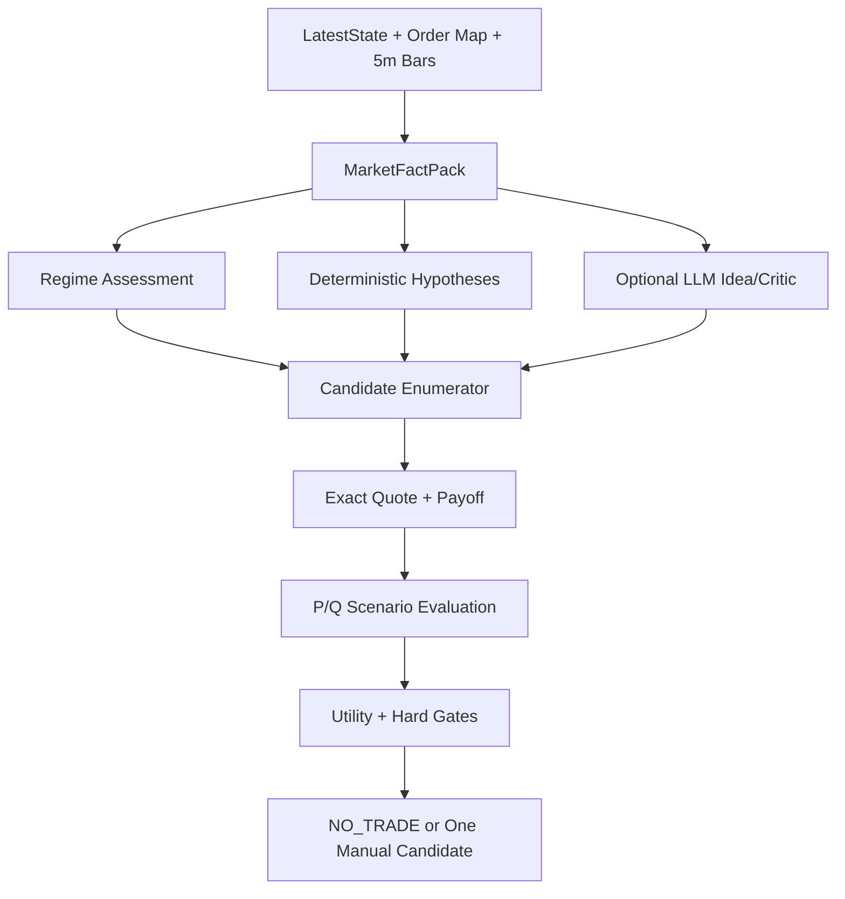

# SPX Spark 0DTE 算法与策略信号引擎设计 v2

状态：**实施合同（Implementation Contract）**
适用仓库：`hzy-hits/SpxOpDaily`
目标路径：`docs/strategy-signal-engine-v2.md`
自动下单：禁止
生产接入方式：历史因果回放通过后，直接进入人工可见的 Manual Candidate，不再额外等待 20 个交易日 Shadow
最后更新：2026-08-15

> **协同基线**：本文档与架构简化工作的排期、依赖白名单、配置与 Rust 边界裁决见
> `docs/architecture-simplification-execution-plan-v1.md` 第 2 节（协同裁决 11–15）与第 4 节 S-track 任务卡。
> 两份文档冲突时以执行方案为准。

---

## 0. 本文解决什么问题

当前系统已经具备较完整的数据采集、行情质量、SPX/ES 坐标、SPXW 期权链、Gamma/Wall、Greeks、回放、通知和只读安全边界，但策略决策仍存在四个根本问题：

1. 市场状态过早被压缩成 Call/Put 方向。
2. 方向确认几乎等同于入场授权，导致 Vertical 容易追涨杀跌。
3. 策略候选空间过于封闭，缺少 Butterfly、失败突破、Pin/De-pin 和正式 NoTrade。
4. “灵感”只存在于文字解释中，没有成为可验证、可计算、可比较的交易假设。

本文规定一套新的统一算法：

```text
实时事实
  -> 多维市场状态
  -> 竞争性交易假设
  -> Vertical / Butterfly / NoTrade 候选
  -> 可执行价格与净收益分布
  -> 唯一人工决策输出
```

本文不是另一份研究愿望清单。它规定：

- 当前实现如何处理；
- 哪些模块继续复用；
- 哪些模块停止拥有交易权限；
- 新算法具体计算什么；
- 信号何时生成；
- 如何选择合约；
- 如何退出；
- 如何立即使用现有一个月数据；
- GPT-5.6 Sol 实施时允许和禁止做什么。

---

## 1. 已确认的架构决策

以下决策视为默认批准，实施者不得自行改写。

### 1.1 不再等待额外 20 个交易日

仓库已经收集约一个月的行情、期权链和派生数据。正确流程是：

1. 立即用已有数据重建 point-in-time 决策快照；
2. 完成因果回放、费用与滑点测试；
3. 通过本文规定的验收门；
4. 直接进入生产报告和人工候选卡；
5. 后续实时数据继续作为监控和校准，不作为“永远不能上线”的借口。

可以使用以下状态：

```text
model_status = bootstrap_live
automatic_ordering = false
manual_action_only = true
```

“Bootstrap”表示统计置信仍有限，不表示候选必须隐藏。

### 1.2 不新建独立服务

新算法接入现有 Order Map / Market Features 调用链。

禁止因为本设计新增：

- 新 systemd daemon；
- 新 timer；
- 新 Redis；
- 新消息队列；
- 新 operational database；
- 新 Rust service；
- 第二套 notification outbox；
- 第二套 market state writer。

### 1.3 不再让任意单个状态直接生成交易

下列内容只能成为事实或特征，不能单独发出 Trade Ready：

- Zero Gamma；
- Put Wall / Call Wall；
- GEX 符号；
- HMM state；
- VWAP 上下；
- Opening Range 突破；
- 单次接受或拒绝；
- LLM 的自然语言判断；
- 宏观偏多或偏空；
- 单一 Delta、Gamma、Vanna 或 Charm 数值。

### 1.4 策略候选第一版固定为五类

```text
NO_TRADE
CALL_DEBIT_VERTICAL
PUT_DEBIT_VERTICAL
CALL_BUTTERFLY
PUT_BUTTERFLY
```

第一版禁止加入：

- Iron Condor；
- Calendar；
- Diagonal；
- Ratio Spread；
- Broken-Wing Butterfly；
- 裸 Call / 裸 Put；
- Credit Spread；
- 自动滚仓。

这些不是永远禁止，而是不能在核心引擎尚未稳定时扩大搜索空间。

### 1.5 所有判断在 SPX 坐标中完成

策略模型统一使用：

```text
SPX price coordinates
SPXW expiry semantics
ES -> SPX qualified basis
```

XSP、SPY 或 SPX 只是执行载体。

模型不得使用 SPY 价格直接计算 SPX 中轴，也不得用 XSP 稀疏订单簿反推 SPX 终值分布。

---

## 2. 当前算法实现梳理

本节是当前仓库的算法地图。实施者在修改前必须确认这些 owner。

### 2.1 Order Map 总编排

当前 `application/order_map/service.py` 的 `build_order_payload()` 同时负责：

- 构造 Options Map；
- 解析 SPX pricing/research spot；
- 生成旧候选；
- 计算 Greeks reference；
- 调用 Greek decision；
- 生成 skew spread shadow；
- 计算 strike coverage；
- 拼装 Gamma、Walls、RN density、Macro、VIX context；
- 后续继续附加 Spring Gamma、Convexity Radar、通知和 Rust projection。

结果是：事实、策略、展示、通知和研究上下文在一个大型 payload 内逐步拼装。

新设计不要求重写整个 Order Map，但必须增加一个唯一策略出口：

```text
payload["strategy_decision"]
```

人类可见的具体交易候选只能来自该字段。

### 2.2 旧候选生成器

当前 `application/order_map/candidates.py` 主要生成：

- `put_wall_bounce_call`
- `flip_breakdown_put`
- `call_wall_fade_put`
- `flip_reclaim_call`
- `call_wall_breakout_call`
- level-decision 派生 Call/Put

其核心流程是：选择结构位 → 找结构位附近的单只 Call 或 Put → 使用 Delta/Gamma 或 Black-Scholes 投影“标的到达结构位时”的期权价格 → 给出 `prob_touch`、`prob_close_beyond` 和 underlier-triggered limit → 后续由其他层再将部分候选包装成 spread。

它适合做结构位价格观察和单腿重定价参考，不适合继续拥有最终交易选择权。

迁移后：

```text
旧 candidates = legacy_reference_only
new strategy_decision = sole human candidate authority
```

### 2.3 GTH Dip-Reclaim

当前 GTH detector 使用 ES 的 15/60 分钟窗口：检测回撤 → 要求一定下降持续时间 → 要求收复一定比例 → 累积 confirm samples 和 hold seconds → 冻结一个 Call Debit Spread；长腿接近当前隐含 SPX，短腿优先锚定上方 Flip/Call Wall，没有墙位时用 Expected Move 或默认宽度。

问题不是 detector 完全无效，而是它把**形态确认、方向判断、价差构造、入场授权**绑定在同一个事件中。

迁移后：

- GTH Dip-Reclaim 只输出 `hypothesis_evidence`；
- 不再独立生成绿色 Manual Ready；
- 统一策略引擎评估它属于：早期失败下破 / 可接受的回踩入场 / 已经 Late Chase / 宏观事件前 NoTrade。

### 2.4 RTH 5 分钟状态

当前八变量状态包括：price vs VWAP、VWAP slope、Opening Range、market structure、efficiency ratio、VWAP cross count、same-time range ratio、sector breadth proxy。

输出：D（方向分数）、Q（路径质量）、V（波动环境）、`TREND_UP / TREND_DOWN / LOW_VOL_RANGE / HIGH_VOL_CHOP / UNCERTAIN`。

该层继续保留，但职责改为：**提供标准化路径特征，不负责选择交易策略。**

尤其：

- LOW_VOL_RANGE 不等于 Butterfly；
- TREND_UP 不等于立即买 Call；
- TREND_DOWN 不等于立即买 Put。

### 2.5 Convexity Idea Radar

当前 Radar 固定四种边界假设：下方拒绝→Call；下方接受→Put；上方拒绝→Put；上方接受→Call。

它已经意识到：LLM 不能编造数值；风险中性终值分布不等于现实概率；多空假设应同时存在；需要 NoTrade 和反证。

但当前候选空间仍然是封闭的，并且策略窗口在 13:00 ET 结束，无法承载尾盘 Pin Butterfly。

迁移后：

- Radar 不再是独立策略系统；
- 其事实提取、冲突描述和 LLM prompt 可以复用；
- 固定四假设和三条 lane 不再拥有最终优先级；
- LLM 输出进入统一 HypothesisSet。

### 2.6 RN Density

当前 `analytics/options/density.py` 使用：OTM mid、Put-Call Parity 合成 Call curve、非均匀二阶差分、负密度 clipping、重新归一化，输出 P10/P25/Median/P75/P90。

第一版继续将其作为 Q_baseline，但必须新增：

- `mode_strike`；
- 每个 5 点执行价附近的局部概率质量；
- density peak count；
- peak stability；
- clipped mass diagnostics；
- 对候选 Butterfly 盈利帐篷的 Q-mass 积分。

它仍然不能被叫做现实胜率。

### 2.7 Experimental HMM

当前固定三状态在线 Gaussian HMM 可以继续作为一个弱特征：

```text
regime_posterior
normalized_entropy
dwell_observations
```

禁止：将 state label 解释成做市商行为；让 HMM 独立决定 Call/Put；让 HMM 覆盖实时价格反证；为了本次策略重写复杂 HMM 框架。

---

## 3. Edge 的正式定义

系统的 edge 定义为：现实条件分布 P、市场隐含定价 Q、执行成本、尾部风险与模型不确定性之间的差值。

具体到策略 j：

```text
Edge_j = E^P[Π_j | X_t] − Premium_exec_j − Fees_j − Slippage_j
```

其中：

- `X_t`：决策时点可见事实；
- `P`：现实路径或终值条件分布；
- `Q`：期权市场隐含分布；
- `Π_j`：策略收益函数；
- `Premium_exec`：保守可执行价格，不是 mid。

市场隐含分布用于解释 `E^P[Π_j] − E^Q[Π_j]`。**不得在已经减去完整市场权利金后，再重复减去 `E^Q[Π]`。**

我们的主要 edge 假设只有三类：

1. Trend Pullback Continuation
2. Failed Break / Reclaim
3. Stable Pin vs De-pin

其余状态默认 NoTrade。

---

## 4. 统一决策流程



统一函数概念：

```python
def build_strategy_decision(
    payload: Mapping[str, object],
    latest: LatestState,
    now: datetime,
) -> StrategyDecision:
    facts = build_market_fact_pack(payload, latest, now)
    regime = assess_regime(facts)
    hypotheses = build_competing_hypotheses(facts, regime)
    candidates = enumerate_candidates(facts, regime, hypotheses)
    evaluated = evaluate_candidates(facts, candidates)
    return select_decision(facts, regime, hypotheses, evaluated)
```

任何人类可见交易卡都必须来自这个函数的结果。

---

## 5. 数据合同

### 5.1 MarketFactPack

```json
{
  "schema_version": "market_fact_pack.v1",
  "decision_at": "2026-08-06T17:25:00Z",
  "session_date": "2026-08-06",
  "minutes_to_close": 155,
  "spot": {
    "spx": 7704.3,
    "es": 7729.8,
    "es_spx_basis": 25.5,
    "pricing_source": "official_spx"
  },
  "path": {
    "vwap": 7712.1,
    "distance_to_vwap_atr": -0.62,
    "opening_range_high": 7742.8,
    "opening_range_low": 7709.9,
    "er_15m": 0.18,
    "er_30m": 0.21,
    "er_60m": 0.26,
    "vwap_crosses_30m": 3,
    "impulse_15m_atr": -0.35,
    "last_new_high_minutes_ago": 102,
    "last_new_low_minutes_ago": 48
  },
  "value_center": {
    "spx_equivalent_15m": 7707.8,
    "spx_equivalent_30m": 7708.4,
    "spx_equivalent_60m": 7709.1,
    "drift_15m_points": -0.6,
    "drift_30m_points": -1.3,
    "drift_60m_points": -2.0
  },
  "cross_section": {
    "spy_return_bps": -16,
    "rsp_return_bps": -64,
    "qqq_return_bps": -24,
    "smh_return_bps": 119,
    "dia_return_bps": -63,
    "iwm_return_bps": 18,
    "sector_breadth_above_vwap": 0.36,
    "cap_weight_equal_weight_divergence_bps": 48,
    "cancellation_score": 0.78
  },
  "volatility": {
    "vix": 15.42,
    "vix_change_bps_15m": -8,
    "vix1d": 11.9,
    "atm_straddle": 16.5,
    "straddle_decay_15m_fraction": 0.08,
    "straddle_decay_30m_fraction": 0.14,
    "same_time_range_ratio": 0.72
  },
  "structure": {
    "zero_gamma": 7709.2,
    "flip_low": 7705,
    "flip_high": 7710,
    "put_wall": 7700,
    "call_wall": 7770,
    "q_mode": 7707.0,
    "q_median": 7706.7,
    "q_clipped_mass_fraction": 0.04
  },
  "event": {
    "state": "normal",
    "next_event": null,
    "minutes_to_event": null
  },
  "quality": {
    "status": "ready",
    "reasons": [],
    "quote_age_max_seconds": 2.1
  }
}
```

所有字段必须：

- 标明单位；
- 缺失时为 `null`；
- 不用零代替缺失；
- 有 `source_at` / `available_at` lineage；
- 决策时满足 `available_at <= decision_at`。

### 5.2 RegimeAssessment

不要再用一个互斥标签解释全部市场。使用四个维度：

```json
{
  "path_state": "BALANCED",
  "path_direction": "DOWN",
  "terminal_state": "PIN_STABLE",
  "event_state": "NORMAL",
  "entry_state": "GOOD_LOCATION",
  "confidence": 0.71,
  "reasons": [
    "low_30m_efficiency",
    "stable_value_center",
    "multiple_center_reversions",
    "vix_non_expansion",
    "cross_section_cancellation"
  ],
  "contradictions": [
    "equal_weight_breadth_still_weak"
  ]
}
```

枚举值：

```text
path_state:     TREND | BALANCED | TRANSITION | UNCERTAIN
terminal_state: PIN_STABLE | PIN_MIGRATING | NONE | UNCERTAIN
event_state:    NORMAL | SCHEDULED_EVENT_RISK | POST_EVENT_DISCOVERY
entry_state:    GOOD_LOCATION | LATE_CHASE | POOR_ASYMMETRY | INSUFFICIENT_DATA
```

这种分解避免出现“市场是 TREND_UP，所以只能买 Call”。市场可以同时是：

```text
path_state = TREND
direction = UP
entry_state = LATE_CHASE
decision = NO_TRADE
```

---

## 6. 基础特征定义

### 6.1 路径效率

```text
ER_h = |P_t − P_{t−h}| / Σ_{i=1..n} |P_i − P_{i−1}|
```

计算 15、30、60 分钟。

Bootstrap 解释：

```text
ER >= 0.45     路径较高效
0.25–0.45      混合
ER < 0.25      轮动/震荡
```

### 6.2 Value Center

第一版直接复用 ES 5 分钟 bar 的成交量加权价格：

```text
VC_h^ES = Σ_i (Price_i · Volume_i) / Σ_i Volume_i
VC_h^SPX = VC_h^ES − Basis_{ES−SPX}
```

计算 15m、30m、60m。中心漂移：

```text
drift = VC_15m^SPX − VC_60m^SPX
```

更稳妥的实现可直接使用 bar typical price：`Price_i = (H_i + L_i + C_i) / 3`。

不要新造 tick-level volume profile 引擎。

### 6.3 Cross-Section Cancellation

目标是检测：指数内部存在强烈相反力量，但市值加权 SPX 的净变化接近零。

初始定义从 `Return_SPY − Return_RSP` 出发，再加入 `SMH − RSP`、`QQQ − DIA`、sector breadth 偏离 50%。

归一化 Cancellation Score：

```text
C = clip( 0.35·z(SPY−RSP) + 0.25·z(SMH−RSP) + 0.20·z(QQQ−DIA)
        + 0.20·(1 − |2·Breadth − 1|), 0, 1 )
```

第一版可以使用历史同时间分位数替代 z-score。

### 6.4 Straddle Decay

```text
decay_15m = (Straddle_{t−15m} − Straddle_t) / Straddle_{t−15m}
```

必须使用：同一到期日、同一 ATM 定义、可用的双边 mid、明确 quote age。

若 ATM strike 发生移动，使用固定的 decision-anchor strike 计算一组，另计算 rolling ATM，二者都保存。

### 6.5 Level Penetration 与 Reclaim

对下方结构位 L：

```text
penetration = (L − min(P)) / ATR_5m
Hold = min(Close_{t−1}, Close_t) − L    # reclaim 后保持
```

上方结构反向定义。

---

## 7. Regime Assessment 规则 v1

这些阈值是 versioned bootstrap，不得声称已经证明为长期 Alpha。

### 7.1 TREND

多头趋势要求：

```text
existing D >= +6
ER30 >= 0.45
VWAP crosses 30m <= 2
price is above VWAP
VWAP slope >= +0.05 ATR
sector breadth >= 0.55
```

空头反向。趋势判断只代表路径背景，不代表立即交易。v41 起 RTH 人读 Debit
为 `EVENT_SETTLEMENT_THRESHOLD`、`ES_VOLUME_MOMENTUM` 与
`PREAVERAGE15_PULLBACK`，并新增用户明确授权的 `WALL_BREAKOUT_HAZARD`。
墙位 hazard 是独立左侧 lane：以因果 SPX 路径尺度归一化 Call/Put Wall、Zero Gamma
与剩余 EM，冻结三分类模型输出未来 15 分钟上破站稳 / 下破站稳 / 未突破概率；仅当
OI-GEX 可用、同向概率至少 0.17、证据不超过 15 秒、目标结算价值下的保守执行 EV > 0
且 exact BBO、通用几何/借记、PIN 与宏观门全部通过时才可出人工卡。它必须标记
`forward-unvalidated`，不得表述为已证明 edge，也不得继承旧策略方向。
`PREAVERAGE15_PULLBACK` 是用户明确授权的独立原始 SPX 五秒路径 lane：只在
60 秒决策点使用因果 15 秒加权前均值触发，固定选 Schwab 60Δ / 15 点价差，不继承
HMM、GEX 方向、旧 entry-quality 或历史方向 stick 门；它必须标记
`forward-unvalidated`，不得表述为
已证明 edge。失败突破、趋势回踩、突破接受只记结构事实。GTH 在 TREND 或
TRANSITION 同向时可出宽链/delta 价差，确认水平 / 回踩收复也可出人读卡。
Desk Map 仍写不做。

### 7.2 BALANCED

```text
ER30 < 0.30
VWAP crosses 30m >= 2
abs(existing D) <= 3
最近30分钟没有被接受的 OR/结构突破
```

### 7.3 TRANSITION

任一满足：

- D 与 ER 冲突；
- VWAP/Opening Range/market structure 不一致；
- 刚从趋势进入低 ER；
- Value Center 仍明显迁移；
- 突破刚失败但尚未完成 retest；
- 跨市场宽度正在翻转。

Transition 仍不挡量比 setup 的枚举。Failed Break 与量比卡都只记事实，不再授权
RTH 人读 Debit。GTH 不受此条关闭。本 session 已有反向 RTH 人读卡时，翻向必须等
cash HMM 同向 TREND，不能只靠 5 分钟反弹；该规则约束 RTH 枚举。

### 7.4 PIN_STABLE

必须在 11:00 ET 以后评估。

钉住分两档，不得混用：

```text
LOOK（观察）：RTH 11:00–13:00，未迁移，输入齐，本地 Q，至少 1 次 excursion-return
TRADE（PIN_STABLE）：现有硬栈，进入仍要 2 次 excursion-return
```

LOOK 只发观察卡，不过 `butterfly_requires_pin_stable`，不能成为蝶式交易候选。
TRADE 才允许枚举 STABLE_PIN 蝶。11:00–13:00 TRADE 按中轴质量盒子评 5/10/15/20/50 点蝶，不写死翼宽；质量已堆在 [K−W, K+W] 内（分数 ≥ 0.50）的梯子档才上架，排序先压过价差再取最窄过门帐篷。LOOK 或 TRADE 钉住时，RTH 方向价差（`ES_VOLUME_MOMENTUM` 以及遗留的失败突破 / 趋势回踩 / 突破接受）不得成为人读卡；PIN_MIGRATING 与 UNCERTAIN 不挡价差。夜盘两档都不评蝶。

硬条件（TRADE / PIN_STABLE）：

```text
ER30 < 0.25
abs(value_center_drift_30m) <= 2.5 SPX points
abs(value_center_drift_60m) <= 5.0 SPX points
最近60分钟至少2次 excursion-and-return
VIX 15m 不持续扩张
最近20分钟无持续新高/新低接受
Gamma center、Value Center、Q mode 三者 max-min <= 5 points
PIN 对齐用的 Q mode 是现价 ±30 的本地 5 点质量峰，不是全链密度 argmax。
上一拍峰值若仍在本地质量前两名、且距当前本地峰不超过 5 点，则保持上一拍。
ATM straddle 15m decay > 0
```

加分：Zero Gamma 在最近 5 点 strike 附近；大整数 strike / OI cluster 重合；Cross-section cancellation 高；RSP 与权重科技方向相反；上下突破都失败。

### 7.5 PIN_MIGRATING

任一硬触发：

```text
abs(value_center_drift_30m) > 5 points
或 abs(value_center_drift_60m) > 8 points
或 ER30 从 <0.25 升到 >0.40
或最近15分钟形成连续新高/新低
```

附加确认：breadth 开始同向；VIX 开始确认；Gamma/Q mode 同时迁移；ATM straddle 不再衰减或重新扩张。

**PIN_MIGRATING 禁止新 Butterfly。**

### 7.6 EVENT RISK

由现有 macro event clock 提供。

默认规则：

- 距离 FOMC、CPI、NFP 等事件 30 分钟以内：禁止普通 Pin/Trend 候选；
- 事件公布后 10 分钟内：POST_EVENT_DISCOVERY；
- 只有重新形成价格、宽度、IV 和 Value Center 后才恢复。

FOMC 14:00 ET 特殊处理：13:30 后禁止新 Butterfly；14:00–14:15 不生成普通候选；14:15 后重新计算所有中心和 surface，不继承 14:00 前 Pin。

---

## 8. Entry Quality 与 Anti-Chase

方向和入场必须分开。

### 8.1 通用 Entry Quality

计算：

```text
distance_to_vwap_atr
impulse_15m_atr
distance_to_trigger_atr
target_room_points
stop_distance_points
target_room_ratio = TargetDistance / StopDistance
debit_fraction_of_width = NetDebit / SpreadWidth
iv_jump_5m
minutes_to_close
```

### 8.2 LATE_CHASE 硬条件

TREND_PULLBACK / FAILED_BREAK（审计与 GTH 标签）任一满足：

```text
abs(distance_to_vwap_atr) > 1.0 且 abs(impulse_15m_atr) > 1.0
或 target_room_ratio < 1.5
或 vertical debit_fraction > 0.45
或 当前价已完成 trigger->target 路径的 60% 以上（失败突破 50%）
或 Call/Put 长腿 IV 在5分钟内上升 > 2 vol points
或 剩余持有时间不足以覆盖规则的最短观察窗口
```

`ES_VOLUME_MOMENTUM` 不用 VWAP 距离 + 15 分钟冲动判追价（那会把第一脚本身杀掉）。
`PREAVERAGE15_PULLBACK` 使用自己的局部尺度对称目标/失效位，不进入本节的 ATR、
VWAP、路径进度或 20 分钟旧管理门；仍受宏观、PIN、Schwab exact-BBO、单腿相对价差
不高于 5%、最大借记、人工确认和 15:45 ET 硬退出约束。
`WALL_BREAKOUT_HAZARD` 不用 HMM/旧方向作触发，但仍走通用 ATR 几何、目标空间、
最大借记和 exact-BBO 门；额外用 `p_break * target_terminal_value - net_debit > 0`
作为保守执行 EV 硬门。
短周期过晚：`abs(return_5m) / ATR5m > 1.5`，或 trigger→target 路程 ≥ 50%，
或借记/空间门与上表相同。

LATE_CHASE 输出：

```text
方向判断可保留
交易候选 = NO_TRADE
reason = direction_valid_but_entry_too_late
```

禁止通过“提高置信度”绕过 Late Chase。

---

## 9. 策略一：ES Volume Momentum Vertical

v38 起重新授权 RTH 人读卡。`TREND_PULLBACK` 仍只出现在
`rth_setups` 审计里。GTH 仍可把夜盘证据标成该旧名，且 GTH 人读 Debit 不走本 setup。

### 9.1 交易假设

ES 短窗口放量，且 1 分钟与 5 分钟动量同向，这一脚会继续走到墙/目标，
现实延续概率高于当前 Vertical 借记隐含的概率。不要求日间 TREND，不等回踩。

### 9.2 Setup

```text
es_volume.label = elevated
es_volume.direction ∈ {up, down}
sign(return_1m) = sign(return_5m) = volume direction
abs(return_1m) >= 0.35
abs(return_5m) >= 1.0
abs(return_5m) / ATR5m <= 1.5
POST_EVENT_DISCOVERY 不挡量比卡；不改 post_event.entry_allowed
LOOK/TRADE pin 不挡
第一张卡：cash HMM BALANCED / TRANSITION / UNCERTAIN / 不可用 不挡
第一张卡：cash HMM 已是反向 TREND → 挡（es_volume_momentum_hmm_opposes）
同向加仓：必须 cash HMM 同向 TREND，且 |5m|/ATR5m >= 0.50
  （es_volume_momentum_add_needs_new_impulse）
翻向：本 session 已有反向 RTH 人读卡时，必须 cash HMM 同向 TREND
RTH winner stick = 900s；stick 内 rank/delivery 不得改方向
借记管理：50% premium stop + trail + 15:45 ET 硬退出；无 20 分钟 time stop
```

空头：volume down + 1m/5m 为负。不要求 `path_state = TREND`，也不等回踩。
清晰度看的是「这一脚是否同向、HMM 有没有反向 TREND」，不是突破回踩操作。

### 9.3 量价输入

复用已有 `es_volume_signal`（量比、放量/缩量、窗口方向）和 market-frame ES
`return_1m_points` / `return_5m_points`。缺量比或动量则失效关闭。

### 9.4 Trigger

触发位 = 本窗起点（spot − es_volume.price_delta）。
目标/失效仍走现有墙位几何。禁止只因 TREND 或 OR 假突破就发卡。

### 9.5 合约枚举

SPX 坐标中：

- Long strike：接近平值或轻度 ITM/OTM，目标 Delta 0.40–0.60；
- Width：5、10、15 点；
- Short strike：不超过目标位；
- 到期：默认同日 0DTE；
- 若剩余时间太短或价格结构要求跨收盘，不自动退回 1DTE，直接 NoTrade。

对每个候选计算 conservative net ask。

### 9.6 Hard Gates

```text
target_room_ratio >= 1.5
debit_fraction <= 0.45
exact quote ready
max risk within account policy
stop distance >= 0.25 ATR5m
stop distance <= 1.0 ATR5m
```

### 9.7 Invalidation

基于标的，而不是只看期权价格：

- 回踩位被两个 5m close 接受；
- VWAP/OR/Wall 失效；
- market breadth 反向；
- Value Center 快速反向迁移；
- VIX 行为与原趋势冲突。

### 9.8 Exit

默认：

- Target 到达：平仓；
- 失效：平仓；
- 20–30 分钟无 follow-through：time stop；
- 达到最大持有时钟：平仓；
- Vertical mark 达到最大价值 70%–80%：优先兑现。

不得把 GTH 10 分钟信号延长到 RTH，除非 RTH 重新授权。

---

## 10. 策略二：Failed Break / Reclaim Vertical

RTH 不再用本 setup 授权人读卡；`rth_setups` 仍计算供审计。GTH 证据仍可映射此名。

### 10.1 交易假设

市场为突破方向支付了波动和动量溢价，但价格、宽度和波动率没有确认，突破失败后回归的现实概率高于期权定价。

### 10.2 Setup

候选结构位：Put Wall、Flip Low / Flip High、Zero Gamma band、Call Wall、Opening Range、Prior Close、RTH VWAP。

### 10.3 下破失败 → Call

必须满足：

```text
penetration between 0.15 and 0.50 ATR5m
reclaim within 5–15 minutes
至少一个5m close收回结构位
下一根不再跌回结构位下方
VIX未持续扩张
至少一个关键宽度代理未确认下跌
```

推荐再等待一次 retest：收复 → 回踩 → 守住。

### 10.4 上破失败 → Put

完全对称。

LOOK 或 TRADE 钉住与失败突破互斥：中轴观察或稳定钉住时，失败突破价差不得成为人读卡。

### 10.5 Entry Quality

Failed Break 的优势是失效位置近。要求：

```text
target_room_ratio >= 1.8
debit_fraction <= 0.40
结构位到 stop 的距离 <= 0.5 ATR5m
```

### 10.6 禁止情形

- 突破后已经在外侧保持 15 分钟以上；
- breadth 与 VIX 已经确认；
- Value Center 已迁移到外侧；
- Q mode 与 Gamma center 同时迁移；
- 只是因为“跌多了”而猜反弹。

---

## 11. 策略三：Stable Pin Butterfly

### 11.1 交易假设

当前期权市场仍为较宽终值分布定价，但现实路径、成交中心和结构中心已经收敛到稳定中轴，长 Butterfly 的可执行借记低于该现实终值集中度的价值。

### 11.2 评估窗口

正常交易日：

```text
最早 11:00 ET
11:00–13:00：LOOK 观察今日中轴；TRADE（PIN_STABLE）按质量盒子评 5/10/15/20/50
翼宽不写死：质量堆到哪一档就上哪一档，过门后取最窄帐篷
14:50–15:30：TRADE 尾盘窗（5 点 ≤70 分钟）
15:30 后仅接受高置信、低成本候选
```

FOMC 或重大 14:00 事件日使用事件规则，不套用普通窗口。

### 11.3 中轴候选

从当前 SPX 附近的 5 点执行价生成：`K ∈ [Spot−30, Spot+30]`，步长 5 点。

### 11.4 Center Score

对每个中轴 K：

```text
CenterScore(K) = 0.25·G(K) + 0.25·V(K) + 0.20·Q(K)
              + 0.15·R(K) + 0.10·T(K) + 0.05·C(K)
              − 0.25·M(K) − 0.20·D(K)
```

所有分项归一化到 0–1。

- **Gamma Alignment (G)**：取 Zero Gamma、Flip 中心和稳定 Wall 中距离最近者 `K_G`：`G(K) = exp(−|K−K_G|/5)`。若 GEX 质量不可用，则该项缺失，不用零代替；剩余权重重新归一化。
- **Value Center Alignment (V)**：`V(K) = 0.5·exp(−|K−VC_30|/5) + 0.5·exp(−|K−VC_60|/7.5)`。
- **Q Local Mass (Q)**：风险中性密度在 `[K−2.5, K+2.5]` 内的质量，相对其他候选归一化。
- **Reversion Evidence (R)**：过去 60 分钟中，价格离开 K 至少 5 点、随后返回 K±2.5 点，记为一次 excursion-return。`0次→0, 1次→0.4, 2次→0.7, >=3次→1.0`。
- **Theta/Straddle Decay (T)**：根据固定 ATM straddle 15/30 分钟衰减分位数归一化。
- **Cross-Section Cancellation (C)**：使用第 6.3 节定义。
- **Migration Penalty (M)**：由 15/30/60 分钟 Value Center 漂移和 Q mode 漂移组成。
- **De-pin Risk (D)**：见下一节。

### 11.5 De-pin Risk

```text
DePinRisk = 0.25·Drift + 0.20·ERAcceleration + 0.20·BreadthAlignment
          + 0.15·VIXResponse + 0.10·ExtremeRecency + 0.10·StraddleReExpansion
```

解释：

- Drift：中心迁移；
- ERAcceleration：路径从震荡变高效；
- BreadthAlignment：内部冲突消失，开始全面同向；
- VIXResponse：波动率开始确认跌势/涨势；
- ExtremeRecency：刚出现并接受新高/新低；
- StraddleReExpansion：衰减停止并重新变贵。

Bootstrap gate：

```text
DePinRisk >= 0.55  -> 禁止 Butterfly
0.35–0.55          -> 仅观察或大幅缩小风险
< 0.35             -> 允许枚举
```

### 11.6 Butterfly 枚举

对 Top 3 中轴枚举单侧翼宽 `W ∈ {5, 10, 15, 20}`。

Call Butterfly：

```text
+1 Call(K−W)
−2 Call(K)
+1 Call(K+W)
```

Put Butterfly 同到期收益相同；执行时选择合成盘口更优的一侧。

到期收益与净收益：

```text
Payoff(S_T) = max(W − |S_T − K|, 0)
PnL = 100·(Payoff − Debit) − Fees − Slippage
BE_low  = K − W + Debit
BE_high = K + W − Debit
```

### 11.7 Conservative Synthetic BBO

Call Butterfly：

```text
NetAsk = Ask_lower − 2·Bid_body + Ask_upper
NetBid = Bid_lower − 2·Ask_body + Bid_upper
```

所有三腿必须：同 provider、同 expiry、quote age 在阈值内、bid/ask 均存在、跨腿 source skew 在阈值内、body 数量明确为 2。

**不能使用 `lower_mid − 2·body_mid + upper_mid` 作为可执行价格。**

### 11.8 结构选择

选择不是“翼越宽越安全”。每个候选比较：

- Max loss / Max profit；
- 盈利区；
- P(PnL > 0)；
- Expected PnL；
- P10/P50/P90；
- Expected Shortfall；
- 中轴偏移 2.5/5/10 点后的 PnL；
- Liquidity；
- De-pin loss。

30 点宽蝶如果比 10 点宽蝶多支付大量权利金，却只扩展少量 breakeven，必须淘汰。

### 11.9 Invalidation / Exit

新 Butterfly 建仓后，任一触发退出：

- Top center 改变 >= 5 点；
- PIN_STABLE → PIN_MIGRATING；
- DePinRisk >= 0.60；
- 价格在一侧翼外获得两个 5m close 接受；
- VIX 和 breadth 同向确认扩张；
- Q mode 与 Value Center 同时迁移。

利润管理：15:30 前达到最大价值的 60% 以上可兑现；中轴稳定且风险可控可持有至接近结算；不使用无限宽松的期权价格 trailing stop；主要按 SPX 中轴和 De-pin 条件管理。

---

## 12. 正式 NoTrade

NoTrade 必须是候选集合中的真实策略：`Score_NoTrade = 0`。

以下均应输出 NoTrade：

- 方向明确但 Late Chase；
- Regime 为 Transition；
- Event Risk；
- Exact quotes 不完整；
- Model uncertainty 太大；
- Butterfly center 分歧过大；
- Pin 正在迁移；
- Vertical 目标空间不足；
- 借记已经过贵；
- P 与 Q 差异不足覆盖成本；
- 当前候选最大风险超过账户上限。

NoTrade 输出必须说明：

```text
最接近的候选是什么
为什么没有通过
什么新事实会重新授权
```

---

## 13. P 与 Q 的第一版实现

### 13.1 Q：市场隐含分布

第一版：复用当前 RN density；新增 mode、local mass 和 candidate payoff integration；保存 clipping 和 strike coverage；density 质量差时 fail closed。

推荐第三方能力：numpy（数组）、scipy.interpolate（平滑曲线）、scipy.optimize（简单约束拟合）；后续如确需严格 bid-ask convex fit，再引入 cvxpy。

**禁止第一版直接手写大型 surface optimizer。**

### 13.2 P：现实条件分布

现有样本约一个月，不适合立刻训练复杂深度模型。第一版采用：**分层经验分布 + 相似历史场景 + 向 Q 收缩。**

场景时间桶：

```text
09:45–11:00
11:00–12:30
12:30–14:00
14:00–15:00
15:00–15:45
```

条件维度：path state、direction、ER bucket、breadth bucket、VIX response、event state、distance to VWAP/level、Pin center drift、time-to-close。

相似度：使用标准化特征距离，推荐 scikit-learn 的 `StandardScaler` + `NearestNeighbors`。不要手写 KD-tree。

收缩：设历史相似场景分布为 `P_emp`，风险中性分布为 `Q`：

```text
w = n_eff / (n_eff + k)
P_v1 = w·P_emp + (1−w)·Q
k = 20（初始）
```

含义：相似历史少时，避免小样本过度自信；数据增加后，现实分布逐渐获得更高权重。

每个决策必须输出：

```text
n_raw
n_effective
shrinkage_weight
historical_sessions
```

### 13.3 Vertical 的 P

Vertical 关心路径，不只是收盘。

历史标签：

```text
target_first
stop_first
neither
time_exit
```

对每个历史相似场景使用实际后续 SPX 路径。

经济结果优先使用历史当时的真实双腿报价；缺失时：可保留方向 outcome；不伪造净 PnL；该样本不能进入经济评分。

Live 候选的场景重定价：复用现有 Black-Scholes projection；对两腿同时重定价；使用历史条件 IV shift；保存 model uncertainty；**不使用单腿 Delta/Gamma Taylor 直接代表 Vertical**。

### 13.4 Butterfly 的 P

Butterfly 持有到结算时，PnL 只需要终值 SPX 和入场借记，因此最容易可靠计算。

历史相似场景直接使用正式结算值：

```text
PnL_i = 100·(max(W − |S_{T,i} − K|, 0) − Debit) − Costs
```

这应成为第一版最可信的经济模型。

---

## 14. Candidate Utility

先应用 Hard Gates，再计算 Utility。归一化到最大亏损：

```text
Utility_j = EV_j/MaxLoss_j − 0.75·ES10_j/MaxLoss_j
          − 0.25·LiquidityPenalty_j − 0.25·ModelUncertainty_j
          − 0.50·MigrationRisk_j − 0.50·LateChasePenalty_j
```

其中 ES10 使用正数形式的左尾损失；Liquidity、Uncertainty、Migration、LateChase 均在 0–1。

候选授权：

```text
Utility > 0
且 conservative lower bound > 0
且所有 hard gate 通过
```

若多个候选通过：先按 Utility；再按较小 MaxLoss；再按较低 execution friction。最终只输出一个 Primary Candidate；最多输出一个 Alternative Observation，**不得同时发多个绿色交易卡**。

---

## 15. LLM Idea / Critic 的正确职责

LLM 不负责：计算价格、计算中轴、计算概率、计算 payoff、选择执行价、覆盖 hard gate、直接创建 Trade Ready。

LLM 接收确定性的 MarketFactPack，输出结构化竞争假设：

```json
{
  "hypotheses": [
    {
      "kind": "stable_pin",
      "thesis": "权重科技与普通股票卖压相互抵消，终值中心可能稳定在7710附近",
      "why_now": [
        "zero_gamma与value_center接近",
        "两次下破失败",
        "VIX未扩张"
      ],
      "contradictions": [
        "等权宽度继续恶化"
      ],
      "falsifiers": [
        "value_center下移超过5点",
        "VIX持续转涨"
      ],
      "eligible_expressions": [
        "butterfly",
        "no_trade"
      ]
    }
  ]
}
```

系统随后验证：每一条 supporting fact 是否真的存在；falsifier 是否可计算；expression 是否属于允许集合。

LLM 不可用时，确定性假设生成器仍能工作。

LLM 只在以下时点调用：Regime 冲突；Pin/De-pin 接近阈值；两种策略 Utility 接近；固定报告时点；重大事件后重新定价。

**禁止每 5 秒调用 LLM。**

---

## 16. Execution Instrument Router

Alpha 和执行载体分开。

### 16.1 Canonical Strategy

统一输出 SPX 坐标，例如 `SPXW 7700/7710/7720 Butterfly`。

### 16.2 执行选择

GTH：`XSP or SPX`；SPY 期权不作为 GTH 执行。

RTH：比较 SPX、XSP、SPY 映射，但必须保持同一经济观点。

选择依据：

```text
max risk
combo spread
quote depth
mapping error
settlement/assignment preference
```

账户风险较小时优先 XSP；SPY 只在 RTH 且映射和流动性明显更优时使用。

---

## 17. 人类输出卡

```text
SPX STRATEGY DECISION · MANUAL CANDIDATE

Desk View
状态      BALANCED + PIN_STABLE
方向      无单边方向
核心判断  终值中心稳定在7710；下破失败，宽度弱但VIX未扩张
反证      RSP仍弱；尾盘若中心下移则De-pin

Why Now
Zero Gamma      7709.2
ES Value Center 7708.4
Q Mode          7707.0
Center Drift    -1.3 pts / 30m
De-pin Risk     0.24
Straddle Decay  14% / 30m

Execution
结构      SPXW 7700/7710/7720 Call Butterfly
自然组合  1.30 / 1.65
人工限价  <= 1.45
替代载体  XSP 770/771/772
有效期    120 秒，提交前重报
禁止市价

Economics
最大亏损  $145
最大收益  $855
盈亏平衡  7701.45 / 7718.55
P盈利     42%（P-bootstrap）
Q盈利质量 36%
P10/P50/P90 -145 / +190 / +790
Utility   +0.18
样本      16 sessions, n_eff=9.4, shrinkage=0.32

Invalidation
中心迁移 >= 5点
De-pin Risk >= 0.60
SPX在7700下方获得两个5m收盘接受
VIX与breadth共同确认下行

Data Quality
三腿报价新鲜，同源，最大age 1.2s，跨腿skew 0.8s
automatic_ordering=false
```

NoTrade 卡也必须使用同样清晰度。

---

## 18. 现有代码的具体迁移方案

### 18.1 新增文件上限

第一阶段最多新增以下 5 个生产文件：

```text
src/spx_spark/application/order_map/strategy_facts.py
src/spx_spark/application/order_map/strategy_regime.py
src/spx_spark/application/order_map/strategy_select.py
src/spx_spark/analytics/options/strategy_payoff.py
src/spx_spark/data_platform/research/strategy_decision_replay.py
```

不新增新的顶层 Python package。

### 18.2 文件职责

**strategy_facts.py**：只负责从现有 payload 和 LatestState 组成 MarketFactPack。必须复用 market_state_5m、options_map、RN density、wall/flip、ES bars、cross-index/breadth、macro event、quote quality。**禁止再次计算一套平行 VWAP/Wall/Gamma。**

**strategy_regime.py**：纯函数——path state、Pin state、event state、entry state、competing hypotheses 的确定性版本。无 I/O，无通知，无 broker import。

**strategy_payoff.py**：纯数学——Vertical payoff、Butterfly payoff、breakeven、conservative synthetic BBO、scenario PnL、quantiles、Expected Shortfall。推荐使用 NumPy；不手写 DataFrame 框架。

**strategy_select.py**：唯一策略 selector——枚举允许候选、调用 quote evaluator、调用 P/Q evaluator、hard gates、utility、输出 StrategyDecision。

**strategy_decision_replay.py**：从现有 Parquet/DuckDB/SQLite lineage 重建 fact pack、candidate、conservative execution、outcome、legacy comparison。**禁止新建第二个历史存储系统。**

### 18.3 修改现有文件

**application/order_map/service.py**：在所有事实附加完成后：

```python
payload["strategy_decision"] = build_strategy_decision(...)
```

通知和 desk projection 只读这个结果。

**application/order_map/candidates.py**：保留为 legacy candidate reference 和 level repricing helper，去掉其人类最终授权。

**application/market_features/gth_manual_candidate.py**：GTH 绿色候选改为调用统一 selector。原 GTH signal 仍可作为 evidence，不再自己决定 spread。

**application/order_map/convexity_idea_radar.py**：保留 fact summary、LLM hypothesis prompt、contradictions；删除或停止使用固定三 lane 的最终排名、13:00 以后完全关闭所有策略思想、将 Call/Put 作为唯一表达。

**application/market_features/market_state_5m.py**：继续输出 D/Q/V 和原始分项。不要在这里直接启用 LOW_VOL_PIN Trade Ready；Pin 由统一引擎计算。

**analytics/options/density.py**：新增 mode/local mass/payoff mass，不改变原 percentile API 的兼容读取。

### 18.4 旧 owner 删除规则

新 strategy_decision 在生产报告中稳定工作后，同一个迁移 PR 或下一紧邻 PR 必须删除/降级：

- fixed Call/Put/Vol opportunity board 的交易优先级；
- GTH direct spread green-card authority；
- legacy candidate 直接进入人类 Trade Ready 的路径；
- 重复的策略选择字段。

**禁止永久双写两套“最终候选”。**

---

## 19. 现有一个月数据的立即回放

### 19.1 决策时点

每个交易日固定重建：

```text
10:00  11:00  12:30  13:30  14:30  15:15 ET
```

并额外加入：wall/flip first touch、reclaim confirmation、breakout confirmation、Pin center material change、De-pin trigger。

### 19.2 因果约束

每个输入必须满足 `available_at <= decision_at`。

禁止：

- 使用盘后 OI 反向填入盘中；
- 使用最终收盘判断当时 Pin；
- 用未来 quote 修复当时缺腿；
- 用当前算法派生标签冒充原始事实。

### 19.3 对照组

每个时点同时计算：

```text
Legacy candidate
New Vertical candidate
New Butterfly candidate
NoTrade
```

### 19.4 成本

至少测试：

```text
entry at conservative synthetic ask
exit at conservative synthetic bid
fees
0 / 0.05 / 0.10 / 0.20 points per leg per side slippage
```

### 19.5 Bootstrap 上线门

无需再等待新 20 天，但历史回放必须满足：

1. 无 lookahead violation；
2. 至少覆盖已有数据中的 15 个完整 session；不足时如实显示；
3. 新策略相对 legacy 在保守成本下改善以下至少两项：net PnL、Expected Shortfall、late-chase loss、false-pin loss；
4. 8 月 5 日 / 8 月 6 日两个冻结案例通过；
5. Manual Candidate 卡可完整生成；
6. automatic ordering 仍关闭。

通过后直接上线人工候选。

---

## 20. 冻结验收案例

### 20.1 2026-08-05

已知结构：高开后趋势下跌；午后约 7740 暂时平衡；最后半小时中轴下移；正式收盘约 7723.55。

预期：

```text
path_state = TRANSITION or TREND
terminal_state = PIN_MIGRATING
DePinRisk 中高
7740 Butterfly 不得成为高置信 Manual Candidate
```

若系统在 15:00 仍把 7740 标为稳定中轴，验收失败。

### 20.2 2026-08-06

已知结构：Zero Gamma 约 7709；ES Value Center 约 7707–7709；下破 7700 未持续；VIX 未扩张；权重科技与等权弱势抵消；正式收盘约 7709.96。

预期：

```text
13:00后 terminal_state 逐步转 PIN_STABLE
7710 进入 Top 3
合理时点 7710 成为 Top 1
7700/7710/7720 被枚举
宽蝶因资金效率差被降级
```

注意：不要求模型预测 7709.96 的最后小数；要求识别稳定中心区。

### 20.3 连续上涨趋势日

预期：

- GTH 不明确不能否决 RTH；
- RTH TREND 可成立；
- 只在第一/第二次受控回踩生成 Vertical；
- 突破后远离 VWAP 时输出 Late Chase；
- 不因宏观故事直接阻断已确认价格趋势。

---

## 21. 测试政策

GPT-5.6 Sol 不得把本设计再次变成测试工程项目。

### 21.1 必须测试

**数学不变量**：Vertical max loss/profit；Butterfly max loss/profit；breakeven；Call/Put Butterfly 到期收益等价；conservative BBO 方向；PnL 分位数和 ES。推荐使用 Hypothesis 处理数学性质。

**因果**：future data 被拒绝；stale quote fail closed；session/expiry 一致；缺腿不生成候选；decision snapshot 可重放。

**策略案例**：8 月 5 日；8 月 6 日；一个趋势回踩；一个 Late Chase；一个 Failed Break；一个 NoTrade。

### 21.2 不要测试

- 每个内部 helper；
- 每一句 LLM 文案；
- 临时权重的所有排列；
- JSON 中每个非关键展示字段；
- 与策略价值无关的 mock 层；
- 只是为了提高 coverage 的分支。

### 21.3 代码预算

第一阶段：

```text
新增生产代码 <= 1,200 行
新增测试     <= 600 行
新增配置项   <= 20
新增服务     = 0
新增数据库   = 0
新增 Rust    = 0
```

超过必须先回到设计审查，不得自行扩张。

---

## 22. 第三方包使用

### 22.1 立即建议

```text
scipy
scikit-learn
hypothesis (dev)
```

用途：SciPy——插值、简单优化、统计；scikit-learn——StandardScaler、NearestNeighbors、Logistic/Quantile baseline；Hypothesis——收益数学性质测试。

### 22.2 暂不立即引入

```text
cvxpy
LightGBM
CatBoost
PyTorch
```

只有以下条件出现才引入：current Q density clipping 明显破坏 mode；简单经验/nearest-neighbor P 无法校准；有足够 session 做 walk-forward；有明确 benchmark 表明新包改善经济指标。

**禁止为了“显得量化”而引入复杂模型。**

---

## 23. GPT-5.6 Sol 实施合同

每个实现 PR 前，必须先输出以下 Change Brief：

```text
Goal
Current owners reused
Files modified
Files added
Files deleted or demoted
End-to-end user-visible behavior
Algorithm formulas changed
Data lineage
Third-party package decision
Tests
Non-goals
Complexity delta
```

硬约束：

1. 先完成一个端到端人工候选，再补外围能力。
2. 不创建第二套 scheduler、outbox、state store 或 report pipeline。
3. 不新增 Rust。
4. 不把内部 Python 函数改成 subprocess/JSON IPC。
5. 不复制已有 VWAP、Gamma、Wall、calendar 或 quote-quality 算法。
6. 新增抽象必须至少有两个真实调用者，否则使用普通函数。
7. 不为每个阶段创建新的 enum/state machine。
8. 同一事实只能有一个 owner。
9. 被替代代码必须删除或降级，不能永久并存。
10. 测试优先保护数学、因果、钱和外部边界，不测试实现细节。

实现结束必须报告：行数增减、模块增减、配置增减、服务增减、数据库增减、删除了哪些旧逻辑。

**不得以“继续 Shadow 20 天”代替完成当前工程接入。**

---

## 24. 实施顺序

### PR 1：统一事实与决策出口

完成：MarketFactPack、RegimeAssessment、StrategyDecision、NO_TRADE、将 legacy candidates 作为对照输入、接入 Order Map 和人类报告。

不完成：Butterfly、新模型、LLM。

### PR 2：Vertical Anti-Chase

完成：Trend Pullback、Failed Break、Entry Quality、Late Chase、两腿 conservative BBO、Legacy vs New replay。

通过回放后，直接替换旧 Vertical 人工权限。

### PR 3：Stable Pin Butterfly

完成：Value Center、Center Score、De-pin Risk、三腿 BBO、Butterfly payoff、Top 3 centers、8 月 5/6 验收。

通过回放后，直接进入人工候选卡。

### PR 4：P/Q 与 Bootstrap Utility

完成：Q local mass、nearest-neighbor empirical P、shrinkage、net PnL quantiles、ES、Utility、NoTrade competition。

### PR 5：LLM Idea/Critic 与旧逻辑删除

完成：结构化假设、contradiction/falsifier、删除 fixed lane authority、删除旧 GTH direct candidate authority、收敛文档和配置。

---

## 25. 完成定义

算法 v2 完成不是“文件都写了”或“测试全绿”。必须同时满足：

1. 一个 Order Map 周期只产生一个 `strategy_decision`；
2. 可以明确输出 NoTrade；
3. 趋势正确但位置过晚时能够拒绝交易；
4. Failed Break 可以独立生成 Vertical；
5. Stable Pin 可以生成 Top 3 中轴；
6. Butterfly 使用三腿真实 conservative BBO；
7. 8 月 5 日识别 De-pin 风险；
8. 8 月 6 日把 7710 列入高质量中轴；
9. 历史回放使用当时可见数据；
10. 人工候选进入现有生产报告；
11. 自动下单仍关闭；
12. 旧最终候选 owner 已删除或降级；
13. 没有新增服务、数据库或 Rust；
14. 代码和测试未超过预算，或有明确批准。

---

## 26. 最终原则

系统以后不再问：

> “现在看多还是看空，所以买什么？”

而是依次问：

1. 当前事实是什么？
2. 当前路径、终值、事件和入场位置分别处于什么状态？
3. 哪些竞争假设仍然成立？
4. 当前最匹配的收益函数是 Vertical、Butterfly 还是 NoTrade？
5. 可执行价格是否仍有优势？
6. 什么事实会立即推翻这笔交易？

最终决策原则：

```text
市场状态不是交易。
方向正确不代表入场正确。
结构位不是做市商承诺。
LLM 灵感必须可证伪。
期权结构必须匹配分布形状。
NoTrade 必须能赢。
所有 Alpha 在 SPX 坐标中形成。
所有价格与风险由确定性代码计算。
```
