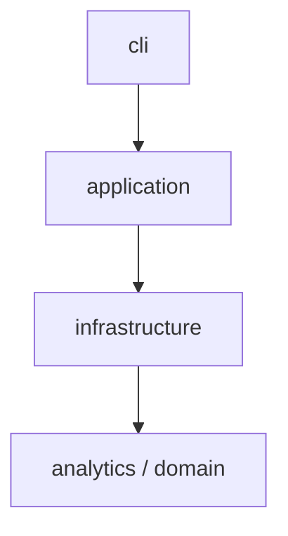

# SPX Spark 模块架构与分层协议

> **状态（2026-09-22）：P1-4 已完成，Import Linter 已替代自研模块登记测试。**
> 当前可执行依赖合同是 [pyproject.toml](pyproject.toml) 中的两个 Import Linter contracts，
> 使用 `uv run lint-imports` 检查。下方旧 L0–L5 图保留为职责与迁移背景，
> 不是仍在运行的 AST 登记规则。Phase 6 Rust 退出和 Phase 7 全面重写已延期，
> 见 [执行方案第 0 节](docs/architecture-simplification-execution-plan-v1.md)。

当前包依赖（静态方向，不代表进程或消息流）：



准确禁止依赖和已接受例外以 `pyproject.toml` 为准；现有顶层 helper 未全部迁移。
完整运行链路见 [README 架构图](README.md#current-runtime-overview-2026-09-22)：
Python Core 拥有最终策略，报告复用其导出；Rust 保留定时桌图和对应投递；
现有 Worker 的 `jobs.py` 调度 `maintenance.py` 独立检查桌图链路并向飞书告警。
会话查询使用现有 Python operational DB 的索引字段；收益回放使用原始券商数据，
策略卡和推送不作为研究样本或收益标签。

当前简化补充（2026-09-05）：canonical latest 的读写直接复用 `storage.LatestStateStore`；
无行为的 `LatestMarketProjectionStore` 子类与 infrastructure 重导出已删除。
见 [回放与测试简化审查](docs/review-replay-correctness-and-simplification-2026-09-05.md)。

范围说明：本文的 Python 分层说明只约束 `src/spx_spark/` Python
应用。`rust/` 是同一 monorepo 内独立的 typed operational workspace，遵守
`rust/AGENTS.md` 与 `rust/docs/ARCHITECTURE.md`；跨语言所有权以
`docs/monorepo-layout.md` 为准。

历史基线：以下职责清单最初在 2026-07-12 与 pre-RTH 计划对齐。
新增或移动模块先核对现有 owner、当前 Import Linter 合同及简化执行方案。

配套：

- 当前依赖检查：`uv run lint-imports`，合同位于 `pyproject.toml`
- 验收计划: `docs/refactor-architecture-acceptance-plan.md`
- 首个 RTH 前实施计划: `docs/pre-rth-refactor-implementation-plan.md`
- Schwab 宽链与 hot lane: `docs/schwab-wide-chain-hot-lane-design.md`
- 结构化信号与机会回放: `docs/structure-signal-vnext.md`
- 进度清单: `artifacts/refactor-acceptance/inventory/report.json`

## 1. 历史职责分层（当前强制合同见文首）

```
L5 orchestration   application/*（realtime / order_map / shock / morning_map /
                   notifications / runtime）, service_loop, maintenance,
                   post_close_review, session_finalize, latest_state,
                   morning_map / order_map / intraday_shock 兼容门面
L4 alerting        alert_engine/*, notifier/*, position_alerts, alert_profile,
                   data_platform, greek_shadow, intraday_event_outcomes,
                   infrastructure/*
L3 analytics       analytics/*（options / greeks）, options_map/*, features,
                   greek_reference, iv_surface, market_context, human_focus,
                   strategy/*, intraday_strategy, steven_validation
L2 providers       ibkr/*（含 ibkr/stream/*）, schwab/*, hyperliquid/*,
                   mock_collector,
                   provider_failover_controller（temporary）
L1 infrastructure  config, storage, state_io, sampling, runtime_mode,
                   provider_adapter, provider_failover, position_events
L0 foundation      marketdata, market_calendar, alert_model, runtime_config,
                   domain/*, settings/*
```

以下为原迁移设计规则，不能据此声称现行 Import Linter 覆盖所有旧顶层模块：

1. 任何模块只能 import 同层或更低层的模块。
2. L0 模块不得 import 任何 spx_spark 内部模块（彼此之间也不行）。
   `config.py` 位于 L1，可从 `market_calendar.py` 重导兼容日历入口。
3. provider 包（L2）之间不得互相 import。
4. 只有 L5 orchestration 可以跨层拼装（import 任意层）。
5. 非 provider / 非 L5 模块不得 import provider 包；例外白名单:
   `position_alerts` → `ibkr.position_watcher`。

## 2. 各层职责与当前包布局

### L0 foundation
- `domain/` — 有界上下文枚举与研究输入合同（SignalMode / DeliveryMode /
  ReplanMode / cross-index research context 等）
- `settings/` — composition-root 类型化设置（stdlib/YAML only）
- `marketdata.py`、`market_calendar.py`、`alert_model.py`、`runtime_config.py`

### L1 infrastructure
- `config.py` — Settings + env helpers + notification/outbox/shock delivery flags
- `storage.py`、`state_io.py`、`sampling.py`、`runtime_mode.py`
- `provider_adapter.py`、`provider_failover.py`、`position_events.py`

### L2 providers
- `ibkr/` — collector / gateway / adapter；流式实现在 `ibkr/stream/*`
  （models / runtime_machine / replan_machine / subscriptions / cache /
  flush / session / supervisor / cli）
- `schwab/`、`hyperliquid/`、`mock_collector`
- `provider_failover_controller.py` — temporary control-document consumer

### L3 analytics
- `analytics/options/` — models（含 `DensityQuality`）、chain、quality、pricing、
  probability、density、exposure、levels、service；`surface_attribution` 负责候选
  入场时冻结行权价坐标的 ATM/左右 skew/左右 curvature 载荷与纯风险降权
- `analytics/greeks/` — black_scholes / higher_order 等纯核
- `options_map/` — LatestState orchestration + CLI；`__init__.py` 为兼容门面（≤150 行）
- `features/`、`greek_reference.py`、`iv_surface.py`、`market_context.py`、
  `human_focus.py`、`strategy/*`、`intraday_strategy.py`、`steven_validation.py`

### L4 alerting / platform
- `alert_engine/` — constants / rules_* / evaluator / cli（候选评估；投递分离）
- `notifier/` — model / policy / state / prompts / sinks / pipeline
- `position_alerts.py`、`alert_profile.py`
- `data_platform/`（含 opportunity-level replay/cost scenarios）、
  `greek_shadow.py`、`intraday_event_outcomes.py`
- `infrastructure/` — ledger / outbox / projection adapters

### L5 orchestration / application
- `application/realtime/` — RealtimeEngine、`OptionsAnalyticsKernel`、composition、
  alert evaluator、health（STARTING/WARMING/READY fail-closed）
- `application/notifications/` — outbox producer/consumer、deliver、settlement
- `application/order_map/` — models / pricing / spot / candidates / machines /
  operator status / transition / render / delivery / service；其中
  `ict_liquidity.py` 负责因果 Sweep/Reclaim、MSS/Displacement 与非正向候选过滤；
  `surface_path_distribution` 负责 Debit 与 Iron Condor 共用的因果五坐标曲面路径回放；
  `order_map.py` 为门面
- `application/shock/` — models / machine / net_premium_flow / evaluator / delivery / service；
  `intraday_shock.py` 为门面（保留 `shock_direct_delivery_enabled` 快路径）
- `application/morning_map/` — build / render / delivery / state / service；
  `morning_map.py` 为门面
- `application/runtime/` — service_loop settings / registry / runner / scheduler；
  `market_regime_denoising.py` 只持有 RTH 因果五秒 pre-average 状态推进，I/O 仍由
  `market_regime_signal.py` 统一负责
- `application/market_features/` — 实时特征编排、GTH 手工候选，以及独立的
  current-session trend transition source 校验与候选生命周期分类；其中
  `physical_close_convergence.py` 负责 15:00 ET 因果 SPX/ES 收盘分布，只输出
  观察事实且不持有交易授权；
  `gth_level_candidate_runtime.py` 负责候选持久化、投递回执对账、人工计划监控、
  gate/replay 日志，候选评估模块仅保留决策与兼容门面；不持有 provider 原始字段
- `service_loop.py`、`maintenance.py`、`post_close_review.py`、`latest_state.py`
- `session_finalize.py` — 盘后单次编排：确定性复盘、immutable replay artifact、
  artifact 授权清理与复用同一 payload 的人类报告/推送

## 3. 兼容门面预算

| 门面 | 预算（非空行） | 实现包 |
| --- | --- | --- |
| `options_map/__init__.py` | ≤150 | `analytics.options` + `options_map.*` |
| `order_map.py` | ≤100 | `application.order_map` |
| `intraday_shock.py` | ≤50 | `application.shock` |
| `morning_map.py` | ≤50 | `application.morning_map` |
| `ibkr/stream_collector.py` | ≤100 | `ibkr.stream` |
| `service_loop.py` | 调度门面 | `application.runtime` |

门面只允许 re-export、参数转换与 deprecation；不得保留第二套业务逻辑。
守护: `tests/architecture/test_facade_size_budget.py`。

## 4. Phase 闸门（摘要）

| Phase | 状态 | 说明 |
| --- | --- | --- |
| 0–4 | PARTIAL | 主要门面已拆，但 typed settings 热路径与大文件债务未完成 |
| 5 realtime | GO (P1) | 生产默认 `OptionsAnalyticsKernel`；`analytics_ok` 要求显式 SUCCESS；STARTING/WARMING + fail-closed |
| 6 outbox | GO-CANDIDATE | outbox/幂等消费已实现，仍需与真实 analytics 做 RTH 集成验证 |
| 7 UDS | NO-GO | 缺 §10.2 连续 RTH 指标证据 |
| 8 Rust | NO-GO | 缺 §11 生产级 benchmark / profiler 证据 |
| §9.2 RTH density golden | NO-GO | 缺实盘 session shadow 语料 |
| P1-C settings | PARTIAL | import-time `runtime_value`=0；残留按文件递减预算（见 architecture test） |

以上为历史验收记录；当前收口状态以简化执行方案第 0 节及各次修复验收文档为准。

## 5. 日常约定

- 新增模块先确认现有 owner 无法承担，再核对当前 Import Linter 合同；不得扩大豁免蒙混过关。
- provider 字段名知识只允许出现在对应 `*/adapter.py`。
- 跨层共享数据结构下沉到 L0（参考 `alert_model.py` / `domain.state_machines`）。
- analytics 纯核禁止 import `storage` / `config` / `notifier` /
  `alert_engine` / `service_loop`（见 `tests/architecture/test_pure_boundaries.py`）。
- `runtime_value()` 新调用点禁止扩张；按需清理边界见简化执行方案 P5-2。

## 6. Pre-RTH 新模块归属

下列为首个 RTH 前计划记录的模块边界，不代表仍待新增。当前修改遵守
`pyproject.toml` 的 Import Linter 合同，不再维护已删除的模块登记测试。

| 模块 | 层 | 职责 | 禁止依赖 |
| --- | --- | --- | --- |
| `analytics/options/snapshot.py` | L3 | 从已归一化 snapshot 构造 chain coverage/readiness | storage/config/provider/notifier |
| `application/realtime/analytics_kernel.py` | L5 | 把 chain 与纯 analytics 拼成 `AnalyticsResult` | provider 原始字段、notification I/O |
| `domain/shadow.py` | L0 | shadow schema/value objects | 所有非 stdlib 模块 |
| `application/realtime/shadow.py` | L5 | 从 tick/analytics 构造 shadow record | notifier sinks |
| `infrastructure/analytics_shadow.py` | L4 | append-only writer/reader | alert evaluator、human delivery |

Schwab 扩展仍全部位于 L2 provider 包：`request_models.py`、`quota_machine.py`、
`market_data_plan.py`、`chain_discovery.py`、`hot_lane.py` 和
`observation_assembler.py`。其中 planner/selector/transition 必须保持无 I/O；跨 provider
比较与 IBKR adaptive validation 位于 L5 application，Schwab/IBKR 包不得互引。

首个 RTH 前的 canonical 流程必须是：

```text
provider adapters -> LatestMarketProjection -> MarketSnapshot
  -> OptionChainSnapshot -> OptionsAnalyticsKernel -> AnalyticsResult
  -> AlertEvaluator -> SQLite outbox
                         \
                          -> analytics shadow writer (no human delivery)
```

`PassthroughAnalytics` 只允许显式测试注入，不得作为生产 composition 默认值。
