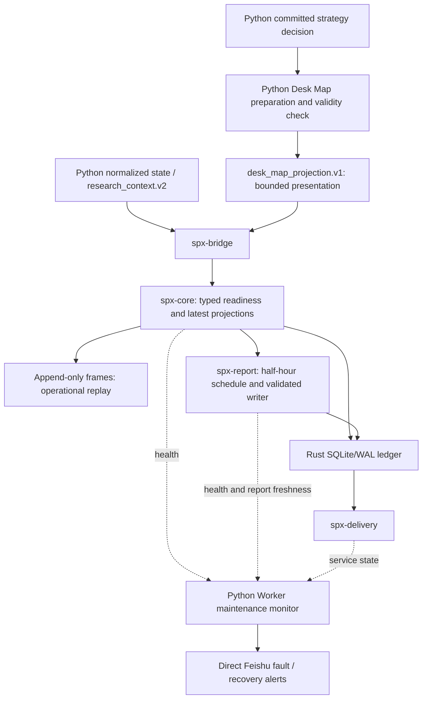

# SPX Spark Core architecture

Status (2026-09-22): bridge, core, scheduled report and delivery are production
Rust owners. Phase 6 retirement is deferred; this workspace remains frozen except
for production-fault repairs. See the [scope decision](../../docs/architecture-simplification-execution-plan-v1.md)
and [whole-system diagram](../../README.md#current-runtime-overview-2026-09-22).
A checked-in unit alone does not prove deployment or runtime health.

## Objective

Rust accepts bounded normalized/advisory projections, applies typed readiness
rules, and owns the half-hour GTH/RTH Desk Map schedule, report ledger and delivery.
Python owns broker sessions, research, `build_strategy_decision`, the existing
manual candidate lane and Desk Map source preparation. Full Python strategy
decisions do not enter the frozen Rust wire contract. The report writer cannot
create or authorize a trading strategy.

Rust wire actions `NO_TRADE` and `MANUAL_CANDIDATE` describe manual advisories;
they do not enumerate Python strategy structures. Neither runtime places,
changes or cancels orders; `automatic_ordering=false` remains in force.

The monitor reuses the existing Worker and maintenance state. It is independent
of the Rust report pipeline, but not of the host, network or Worker. See
[monitor acceptance](../../docs/desk-pipeline-monitor-2026-09-21.md).
Original broker option/underlying history remains the causal strategy backtest
source. Frames and ledger explain operational transitions; notifications or
selected decisions must not define the strategy research sample.

The bridge boundary is intentional. Rust does not connect directly to IB
Gateway or Schwab. Python retains provider SDK/session ownership and writes
bounded atomic projections; `spx-bridge` translates only those files into the
closed, versioned contracts in `spx-domain`. It does not import Python modules,
call a broker, compose a report or enqueue a notification.

Session, provider, readiness and delivery lifecycle semantics are frozen in the
[state-machine contract](STATE_MACHINES.md). In particular, `MarketSession`
contains only SPX `GTH` and `RTH`; CME `Globex` metadata and the independent
`CLOSED` calendar gate are not session variants.

## Component ownership

| Component | Owns | Must not own |
|---|---|---|
| `spx-domain` | Versioned wire types, enums, validation and canonical hashes | I/O, settings, broker SDKs |
| `spx-bridge` | Bounded source reads, provider mapping, durable generation/sequence/pending frame, typed ACK and health | Broker SDKs, strategy generation, notifications, research |
| `spx-core` | Unix ingress, quote book, decision snapshot, readiness, deterministic policy, health projection and append log | Network delivery, research fitting, orders |
| `spx-ledger` | The Rust SQLite/WAL database, owner fencing and legal state transitions | Analytical history or provider connections |
| `spx-report` | GTH/RTH `:00`/`:30` ET schedule, durable desk-map read, DeepSeek writer, full report validation and scheduled-report intent | Provider sessions, HMM fitting, trade decisions, delivery transport |
| `spx-delivery` | Claim, atomic `InFlight` transition, rendering, transport, retry, receipts, uncertain outcome and DLQ | Strategy decisions or a second outbox database |
| Python application | Broker sessions, strategy decisions and candidate lane, source projections, research/replay, independent maintenance alerts | Rust half-hour schedule, report writer, Rust ledger/outbox and its delivery owner |

`spx-report` and `spx-delivery` each guard outbound I/O with two independent
permissions: typed configuration and an explicit CLI flag. Checked-in examples
remain disabled and are not deployment authority.

## Half-hour Desk Map ownership

The existing Python report-preparation timer publishes one complete `desk_map_projection.v1` by atomic
replace. The projection contains typed lifecycle, level, direction, thesis,
quality and optional embedded `research_context.v2`, plus a deterministic
eight-section source message. It carries `action_authority=none` and
`automatic_ordering=false`.

The bridge validates and mirrors that projection into core's durable latest
file. During active GTH and RTH segments, `spx-report` alone owns the ET
half-hour slots (`:00` / `:30`). The `20:15` GTH projection remains an audit
snapshot; the first GTH human map is `20:30`. GTH source-slot keys include the explicit `gth` session token and both
sessions use ET wall time. The service reads only a fresh, still-valid core
projection, checks the stable slot in the ledger before a model call, and uses
a generation-fenced `report` owner lease. A report is stored as
`notification_intent.v2` with `scheduled_report` lineage keyed by source
projection and ET slot; it never invents a trade decision ID.

The writer is fixed to `deepseek-v4-flash` with thinking enabled,
`reasoning_effort=max`, and provider JSON Output (`response_format=json_object`).
`flash-max` is an operating mode, not a separate model
identifier. The provider must return one strict JSON object containing the
title and all eight non-empty sections: Desk View, Location, Structure, Primary
Path, Alternative Path, Targets, Execution and Data Quality. Non-terminal
scheduled reports preserve that validated message without generic character
truncation. If the typed source projection is terminal, `spx-report` ignores
the writer's presentation and creates a deterministic neutral `STANDBY` from
the original projection's current location and reference structure. Its title
is neutral, its trigger always waits for a new price event, and no old
LONG/CALL direction or trigger can survive. A provider response with
`finish_reason=length`, missing sections or unknown fields fails closed and is
not persisted as a completed report.

The old Python timer remains useful after cutover because it refreshes the
atomic projection. `SPX_RUST_REPORT_OWNER=true` changes only scheduled-report
ownership: Python persists the projection but does not enqueue the legacy
report. This is the single-writer fence between the two implementations.

## Provider and session policy

Provider selection is fail-closed and session-specific:

| Session | Primary rule | Fallback rule | Failure behavior |
|---|---|---|---|
| GTH | Exact SPXW quotes must come from IBKR | No Schwab execution fallback | Emit `NO_TRADE` when IBKR is not live and entitled |
| RTH | Schwab first | IBKR only when explicitly enabled and recorded | Emit `NO_TRADE` when no permitted provider has fresh exact legs |

Frozen Schwab GTH quotes may be retained for audit but cannot authorize a
candidate. A process being alive does not establish readiness; transport,
entitlement, provider source time, quote quality, both NBBO sides, contract
identity, quote age and cross-leg skew are separate checks.

IBKR error `10197` means another client, including the user's mobile or TWS
session, owns the shared live-data entitlement. The IBKR bridge must publish an
`external_session_owns` state with `competing_session_10197` evidence, stop
aggressive acquisition, and back off. Neither bridge nor core may evict or
compete with the user's trading session. During this state:

- GTH new candidates fail closed;
- RTH may continue through fresh Schwab data;
- TCP reconnection or a running Gateway does not prove recovery;
- only a fresh usable provider flush may return the data plane to live.

The legacy `state.json` is a replaceable projection, not an event queue. The
bridge sends one complete provider snapshot in one frame using
`replace_provider_snapshot`; the core removes all prior quotes for that provider
before installing the accepted replacement. If the frame is rejected, the
bridge leaves the exact payload pending, exits readiness, and cannot submit an
evaluation. Zero or negative sides become missing, crossed books lose both NBBO
sides, and source timestamps are never replaced with file mtime or heartbeat
time.

## State and durability

Within Rust there is one mutable operational ledger, separate from the existing
Python operational database. The Rust ledger contains ingress
idempotency, owner leases, decisions, notification events, targets, attempts,
receipts, cancellations, DLQ state and operator actions. SQLite runs in WAL mode
and schema constraints reject illegal states.

Large market history does not belong in SQLite. Intraday normalized frames are
append-only and immutable. Daily NDJSON is split into size-bounded numbered
segments. Quote batches use ordinary appends; an evaluation frame is durably
synced before its decision is processed, and rotation syncs the segment being
closed. A configured filesystem reserve is checked before every production
append. Retention deletes only strict regular segments from completed UTC days,
oldest first, while the current UTC day is protected. The live quote book is
also bounded by age and entry count, while a
separate bounded identity cache continues to reject conflicting recent batch
IDs. After the session, a Python job turns the bounded frames and decision
lineage into a versioned replay artifact and Parquet. The
artifact builder must prove that every replayed decision sees only the same data
that was available at its original decision time.

## Delivery outcome semantics

A transport call has four materially different outcomes:

1. confirmed delivered;
2. confirmed retryable failure;
3. confirmed permanent failure;
4. transport started but outcome unknown.

The fourth case is `uncertain`, not `pending` and not `delivered`. It must not be
automatically resent because doing so can duplicate a human-facing alert. An
operator must inspect the external target and record an explicit acknowledgement
or, only after confirming non-delivery and while the intent TTL remains valid,
an explicit replay. Historical attempts and receipts remain immutable. The
target key and delivery channel are frozen together when the intent enters the
ledger; changing a same-named runtime adapter cannot reroute old work.

`spx-delivery` claims both decision-linked v1 intents and scheduled-report v2
intents from the same ledger. For v2 it renders the complete title and eight
sections; transport limits produce an explicit delivery outcome rather than a
silently shortened message.

For decision-linked operator notifications the ledger retains the complete,
immutable ingress payload, while delivery applies a deterministic role
projection. `setup` becomes a compact `WATCH` without an exact-contract entry
instruction; `trade_ready` retains the opportunity identity, exact contract or
spread, decision NBBO, limit, validity, invalidation, risk, target and
reward/risk; `exit` preserves the terminal lifecycle account. Research context
cannot crowd those fields out of the human action card.

The economic-opportunity lifetime and quote lifetime are independent. A
confirmed opportunity is actionable for five minutes by default, configurable
only within five to ten minutes, while an executable option quote must normally
be no more than 10--15 seconds old. Quote staleness pauses that delivery attempt
until a fresh re-quote passes validation; it does not by itself expire or create
a new opportunity. Structural invalidation, the entry cutoff and the hard exit
clock remain terminal.

## Security boundary

- Core accepts local Unix-socket ingress only.
- Broker and notification credentials are never stored in the ledger, config
  examples, logs, fixtures or replay artifacts.
- Secret values are supplied by runtime environment variables whose names, not
  values, may appear in configuration.
- Unknown schema versions, enum values and provider states fail closed.
- Exposure metrics derived from OI or volume remain labeled proxies. The system
  does not claim to know dealer or market-maker inventory.
- HMM/regime/range content in a Desk Map is labeled advisory context. It may
  change explanatory text, but cannot create `TradeReady`, bypass readiness,
  select a contract, or grant order authority.
- No production deployment, service enablement or network change is authorized
  by this architecture document.
